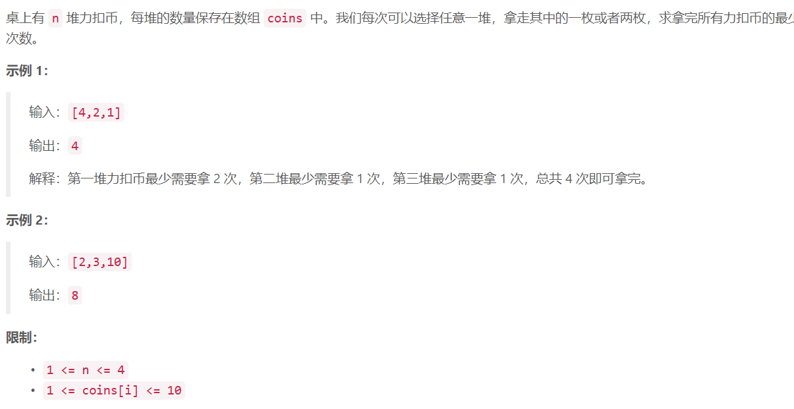

### 1. 拿硬币


  

## Java solution
```java
class Solution {
    public int minCount(int[] coins) {
        int cnt=0;
       for(int i=0;i<coins.length;i++)
       {
           cnt+=coins[i]%2==0?coins[i]/2:coins[i]/2+1;
       }
        return cnt;
    }
}
```