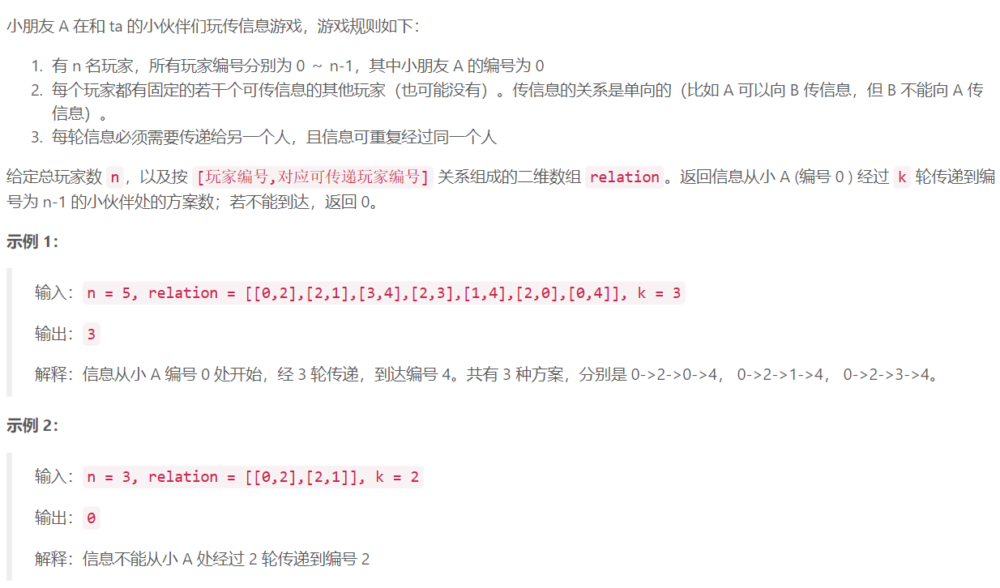
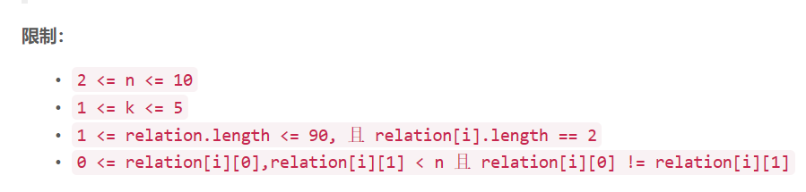

### 2. 传递信息



  

## Java solution
```java
class Solution {
    int res=0;
    public int numWays(int n, int[][] relation, int k) {
        boolean[][] canGet=new boolean[n][n];
          for(int i=0;i<relation.length;i++)
          {
              canGet[relation[i][0]][relation[i][1]]=true;
          }
          backTrack(n, canGet, k,0,0);
        return res;
    }
    public void backTrack(int n,boolean[][] canGet, int k,int cnt,int cur)
    {
        if(cnt==k)
        {
            if(cur==n-1)++res;
            return;
        }
        for(int i=0;i<n;i++)
        {
            if(canGet[cur][i])
            {
                backTrack(n, canGet, k,cnt+1,i);
            }
        }
    }
}
```