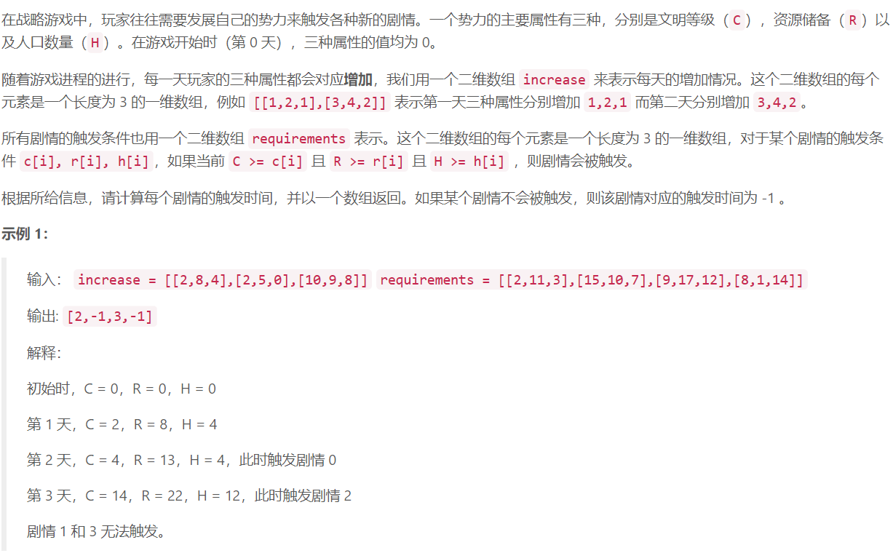
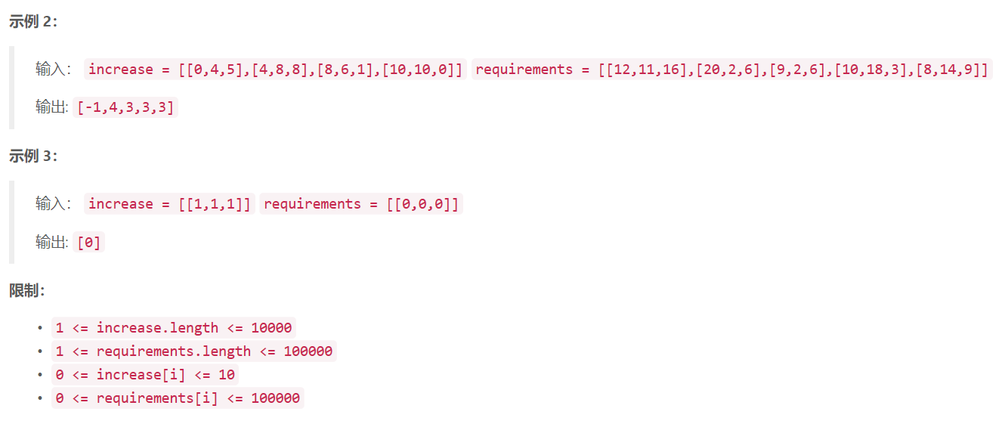

## 3. 剧情触发时间

  

## Java solution
```java
class Solution {
    public int[] getTriggerTime(int[][] increase, int[][] requirements) {
        int[][] sum=new int[increase.length+1][3];
        int[] res=new int[requirements.length];
        for(int i=0;i<requirements.length;i++)
        {
            res[i]=-1;
        }
        for(int i=1;i<=increase.length;i++)
        {
            sum[i][0]=sum[i-1][0]+increase[i-1][0];
            sum[i][1]=sum[i-1][1]+increase[i-1][1];
            sum[i][2]=sum[i-1][2]+increase[i-1][2];
        }
        for(int i=0;i<requirements.length;i++)
        {
            for(int j=0;j<increase.length+1;j++)
            {
                if(requirements[i][0]<=sum[j][0]&&requirements[i][1]<=sum[j][1]&&requirements[i][2]<=sum[j][2])
                {
                    res[i]=j;
                    break;
                }
            }
        }
        return res;
    }
}
```