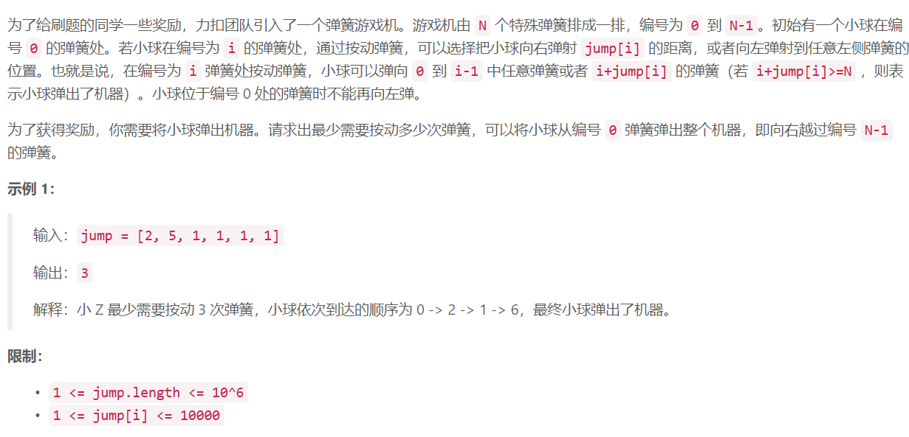

## 3. 剧情触发时间

## 

## Java solution
```java
class Solution {
    //两种情况
    // j->i->i+jump[i]  j>i
    // i->i+jump[i]  
    //dp[i] 表示到位置i的最小弹跳次数
    public int minJump(int[] jump) {
          //pair<j,dp[j]>
          //最小堆 保存当前最小弹跳次数以及对应的位置
           PriorityQueue<Pair<Integer,Integer>> minHeap = new PriorityQueue<>(11,new Comparator<Pair<Integer,Integer>>(){ //大顶堆，容量11
           @Override
           public int compare(Pair<Integer,Integer> i1,Pair<Integer,Integer> i2){
              return i1.getValue()-i2.getValue();
           }
          });
          int n=jump.length;
          int[] dp=new int[n+1];
          for(int i=1;i<=n;i++) dp[i]=n;
          for(int i=0;i<n;i++)
          {
              while(!minHeap.isEmpty()&&minHeap.peek().getKey()<=i) minHeap.poll();//找到大于当前位置且弹跳次数最少的j
              int next=Math.min(i+jump[i],n);
              int cnt=dp[i]+1;
              if(!minHeap.isEmpty()) cnt=Math.min(cnt,minHeap.peek().getValue()+2);//+2是因为j-->i-->next 两步
              if(dp[next]>cnt)
              {
                  dp[next]=cnt;
                  Pair<Integer,Integer> pair=new Pair<>(next,cnt);
                  minHeap.offer(pair);
              }
          }
        return dp[n];
    }
}
```