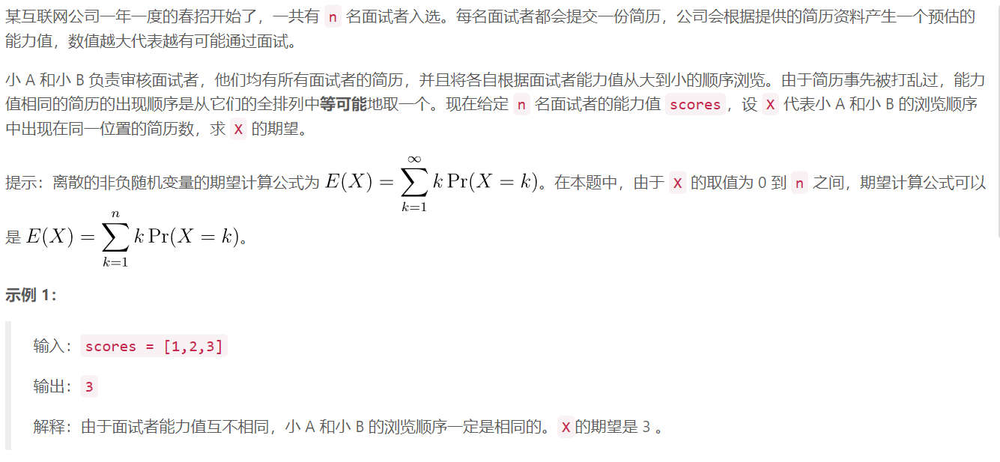
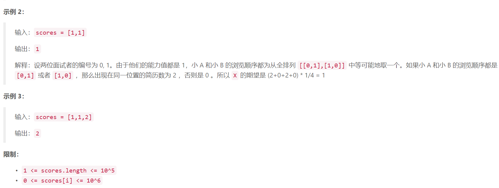

### 1. 拿硬币





  

## Java solution
```java
class Solution { 
    public int expectNumber(int[] scores) {
        //假设a 选123 b有6种选择
        //123 132 213 231 312 321
        // 保持和原数相同的有 123 12 1 六个数 那么期望就是 6/6=1
        //因此 不论全排列长度为几 期望都是1
        //比如 11122333 最终期望就是3
         Arrays.sort(scores);
         int i=0;
         int res=0;
         while(i<scores.length)
         {
             while(i<scores.length-1&&scores[i]==scores[i+1])++i;
             ++i;++res;
         }
        return res;
    }
}
```