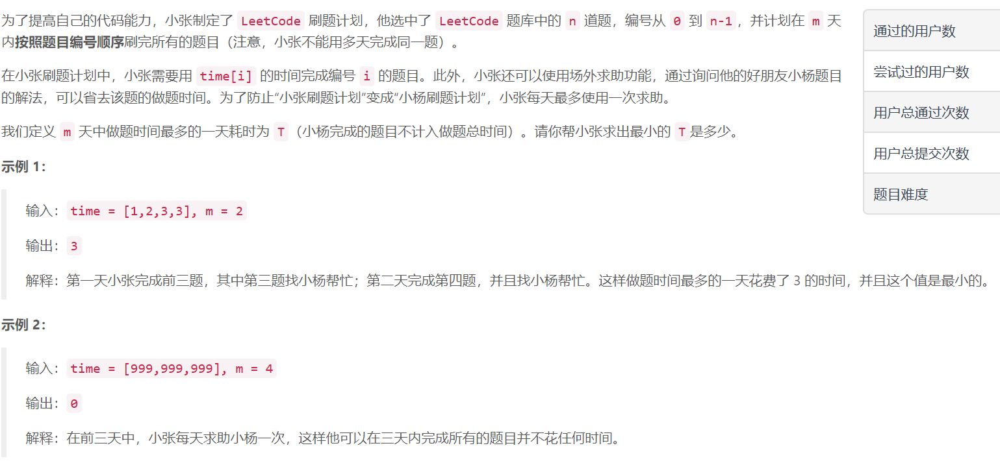
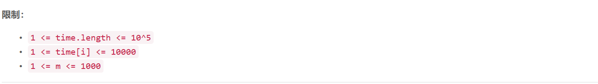

### 2. 小张刷题计划



  

## Java solution
```java
class Solution {
    public int minTime(int[] time, int m) {
        if(time.length<=m) return 0;//天数大于题目数 小杨全做
        int n=time.length;
        int left=0,right=2000000000,ans=0;//time.length x time[i]的上界是1000000000 这里需要取mid
        while(left<=right)
        {
            int mid=(left+right)>>1;//mid表示当前T的上界
            int maxToday=0,sumToday=0;//当前这一天的最大值和花费时间
            int days=1;
            for(int i=0;i<n;i++)
            {
                maxToday=Math.max(maxToday,time[i]);
                sumToday+=time[i];
                if(sumToday-maxToday>mid)//如果超过当前上界 所需天数+1
                {
                    sumToday=maxToday=time[i];
                    ++days;
                }
            }
            if(days>m)//所需天数大于m 不满足要求
            {
                left=mid+1;
            }
            else//所需天数小于等于m 且以mid为上界 说明mid仍可以继续减小
            {
                right=mid-1;
                ans=mid;
            }
        }
        return ans;
         
    }
  
}
```