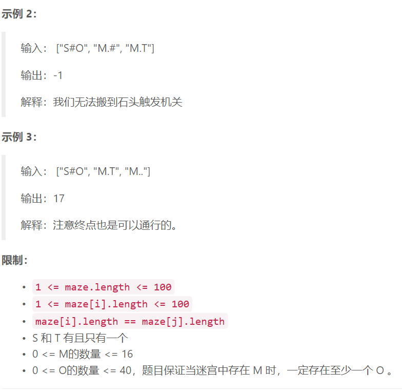

### 3. 寻宝


  

## Java solution
```java
class Solution {
    int INF=100000000;
    public int minimalSteps(String[] maze) {
       
       int row=maze.length,col=maze[0].length();
       char[][] Maze=new char[row][col];
       Point src=new Point(0,0); 
       Point dst=new Point(0,0);
       List<Point> M=new ArrayList<>();//存放机关
       List<Point> O=new ArrayList<>();//存放石堆
       for(int i=0;i<row;i++)
       {
           for(int j=0;j<col;j++)
           {
               char c=maze[i].charAt(j);
               Maze[i][j]=c;
               switch(c)
               {
                   case 'S':src.x=i;src.y=j;break;
                   case 'T':dst.x=i;dst.y=j;break;
                   case 'M':M.add(new Point(i,j));break;
                   case 'O':O.add(new Point(i,j));break;
                   default:break;
                       
               }
           }
       }
       int[][] d=bfs(Maze,src);//计算起点出发的距离
       if(d[dst.x][dst.y]>=INF)return -1;//无法到达终点dst 
       int numM=M.size();
       for(int i=0;i<numM;i++)
       {
           if(d[M.get(i).x][M.get(i).y]>=INF)return -1;//存在机关无法到达
       }
        int numO=O.size();
        if(numM==0)return d[dst.x][dst.y];//无机关 只需返回起点到终点的距离即可
        if(numO==0)return -1;//无石堆 无法找到宝藏
        System.out.print(numM+" "+numO+" "+d[dst.x][dst.y]);
        int[][][] d_M=new int[numM][row][col];//存放所有机关的距离矩阵
        for(int m=0;m<numM;m++)
        {
            int[][] cur=bfs(Maze,M.get(m));
            for(int i=0;i<row;i++)
            {
                for(int j=0;j<col;j++)
                {
                    d_M[m][i][j]=cur[i][j];
                }
            }
        }
        int Pow=1<<numM;
        int[][] f=new int[Pow][numM];
        for(int i=0;i<Pow;i++)
        {
            Arrays.fill(f[i],INF);
        }
        for(int i=0;i<numM;i++)
        {
            for(int k=0;k<numO;k++)
            {
                int cur=1<<i;
                //d[O.get(k).x][O.get(k).y] 源到石堆的距离
                //d_M[i][O.get(k).x][O.get(k).y] 机关到石堆的距离
                //f[1<<i][i] 保存从起点到石堆再到第i个机关的最小距离 
                f[cur][i]=Math.min(f[cur][i],d[O.get(k).x][O.get(k).y]+d_M[i][O.get(k).x][O.get(k).y]);
            }
        }
        int[][] g=new int[numM][numM];
        for(int i=0;i<numM;i++) for(int j=0;j<numM;j++) g[i][j]=INF;
        for(int i=0;i<numM;i++)
        {
            for(int j=0;j<numM;j++)
            {
                for(int k=0;k<numO;k++)
                {
                    //g[i][j] 保存从机关i到石堆再到第j个机关的最小距离 
                    //d_M[i][O.get(k).x][O.get(k).y]+d_M[j][O.get(k).x][O.get(k).y] 两两机关之间到同一个石堆k的距离的距离
                    g[i][j]=Math.min(g[i][j],d_M[i][O.get(k).x][O.get(k).y]+d_M[j][O.get(k).x][O.get(k).y]);
                }
            }
        }
        for(int set=0;set<Pow;set++)
        {
            for(int i=0;i<numM;i++)
            {
                if(f[set][i]<INF)
                {
                    //从起点到石堆再到第i个机关 再从第i个机关到第j个机关 
                    for(int j=0;j<numM;j++)
                    {
                        int cur=1<<j;
                        if((set&cur)==0)//相与为0说明i!=j
                        {
                            //set|cur 将第i位和第j位同时置为1  这样表示已经经过了第i个机关和第j个机关
                            f[set|cur][j]=Math.min(f[set|cur][j],f[set][i]+g[i][j]);
                        }
                    }
                }
            }
        }
        int res=INF;
        for(int i=0;i<numM;i++)
        {
            // 10000000-1=01111111 所有位都为1 说明所有机关都经过了
            int cur=1<<numM;
            //f[cur-1][i] 表示进过所有机关最终到达第i个机关 再加上第i个机关到终点的距离d_M[i][dst.x][dst.y]
            res=Math.min(res,f[cur-1][i]+d_M[i][dst.x][dst.y]);
        }
        return res>=INF?-1:res;
        
    }
    private int[][] bfs(char[][] maze,Point src)//返回从src出发 到maze上每一点的距离
    {
        int row=maze.length,col=maze[0].length;
        int[][] d=new int[row][col];
        for(int i=0;i<row;i++)
        {
            Arrays.fill(d[i],INF);
        }
        List<Point> que=new ArrayList<>();
        que.add(src);
        d[src.x][src.y]=0;
        for(int i=0;i<que.size();i++)
        {
            int x=que.get(i).x;
            int y=que.get(i).y;
            for(int dx=-1;dx<=1;dx++)
            {
                for(int dy=-1;dy<=1;dy++)
                {
                    if(Math.abs(dx)+Math.abs(dy)==1)//上下左右四种情况
                    {
                        int x2=x+dx;
                        int y2=y+dy;
                        if(x2>=row||x2<0||y2>=col||y2<0) continue;
                        if(maze[x2][y2]=='#')continue;
                        if(d[x2][y2]<INF)continue;//由于是BFS 所以能够之前能到达的点距离 src的距离最近
                        d[x2][y2]=d[x][y]+1;
                        que.add(new Point(x2,y2));
                    }
                }
            }
        }
        return d;
    }
}
class Point
{
    public int x,y;
    public Point(int x,int y)
    {
        this.x=x;
        this.y=y;
    }
}
```