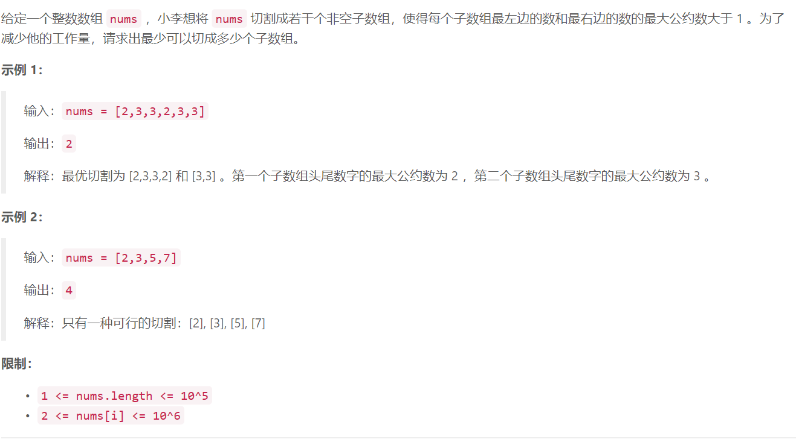

### 4. 切分数组

## 

## Java solution
```java
class Solution {
    int res=Integer.MAX_VALUE;
    public int splitArray(int[] nums) {
        int n=nums.length;
       int SIZE=1000000;
       int[] p=new int[SIZE+1];//保存输入范围内所有数的最大因数
       int[] g=new int[SIZE+1];//保存nums中有相同因数的所有元素的最小索引对应的拆分数组数 
       Arrays.fill(g,100000);
       for(int i=2;i<=SIZE;i++)
       {
           if(p[i]==0)
           {
               for(int j=i;j<=SIZE;j+=i)
               {
                   p[j]=i;
               }
           }
       }
       int last=0;//当前索引前一个索引能拆分的最小数组数 
       for(int i=0;i<n;i++)
       {
           int cur=Integer.MAX_VALUE;//当前索引能拆分的最小数组数 
           for(int m=nums[i];m>1;)
           {
               int x=p[m];//x是当前num的最大因数 如出现6=2*3 x=3 
               g[x]=Math.min(g[x],last);//两种情况 3(g[x]) xxxx 6 以及 xxxxlast 6
               cur=Math.min(g[x]+1,cur);//新增加一个拆分数组判断当前的自小拆分数组数
               m/=x;//还需要检查m=2的情况
           }
           last=cur;
       }
       return last;
    }

}
```