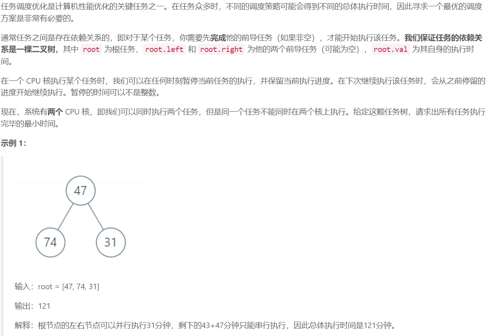
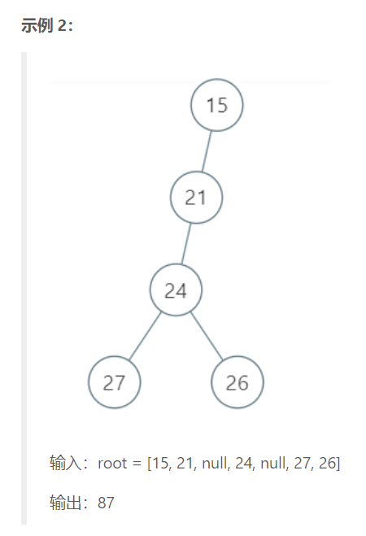
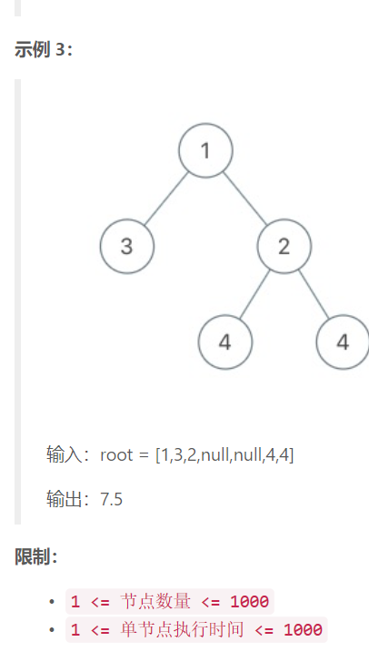

## 5. 二叉树调度任务

  



## Java solution

```java
/**
 * Definition for a binary tree node.
 * public class TreeNode {
 *     int val;
 *     TreeNode left;
 *     TreeNode right;
 *     TreeNode(int x) { val = x; }
 * }
 */
class Node {
    double sum,single;
    
    public Node() {
          sum=0;//当前子树所有节点之和
          single=0;//当前子树所有只能串行执行的时间之和
    }
}
class Solution {
    public double minimalExecTime(TreeNode root) {
          Node res=dfs(root);
          return res.sum/2.0+res.single/2.0;//res.sum/2.0是认为所有节点都可以并行执行 前一部分包含了res.single的1/2，因此只需要正在加一个res.single/2
    }
    private Node dfs(TreeNode root)
    {
        Node node=new Node();
        if(root==null) return node;
        Node left=dfs(root.left);
        Node right=dfs(root.right);
        node.single=root.val;
        node.sum=root.val+left.sum+right.sum;
        if(left.sum<right.single)
        {
            node.single+=right.single-left.sum;
            return node;
        }
        if(left.single>right.sum)
        {
            node.single+=left.single-right.sum;
            return node;
        }
        //除了以上两种情况其余情况可以并行执行 无串行时间
        return node;
    }
}
```