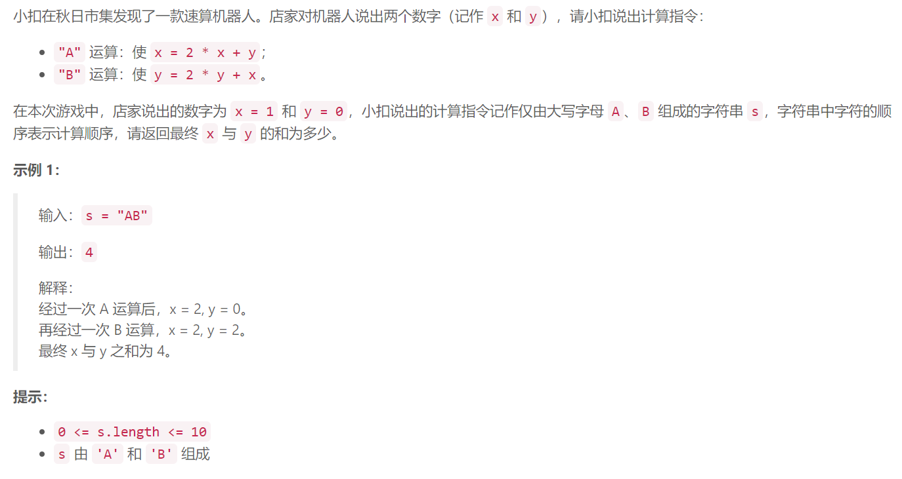

### 1. 拿硬币


  

## Java solution
```java
class Solution {
    public int calculate(String s) {
      int x=1,y=0;
       for(char c:s.toCharArray())
       {
           if(c=='A')
           {
               x = 2 * x + y;
           }
           if(c=='B')
           {
               y = 2 * y + x;
           }
       }
        return x+y;
    }
}
```