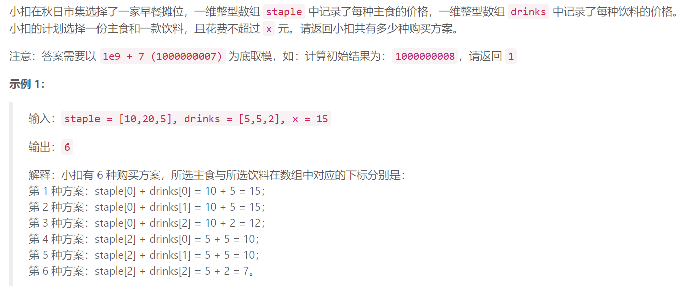
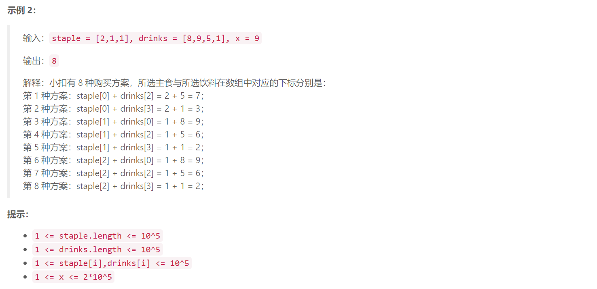

### 2. 早餐组合



  

## Java solution
```java
class Solution {
    long mod=(long)1e9+7;
    // 1 1 2
    // 1 5 8 9 
    // 
    // 5 10 20
    // 2 5 5
    public int breakfastNumber(int[] staple, int[] drinks, int x) {
       long res=0;
        int len1=staple.length,len2=drinks.length;
        Arrays.sort(staple);
        Arrays.sort(drinks);
        int j=0;
        for(int i=len1-1;i>=0;i--)
        {
            //System.out.print(i+" "+j+" "+staple[i]+" "+drinks[j]+"\n");
            if(staple[i]+drinks[j]>x)continue;
            int cnt=1;
            for(;i>0&&staple[i]==staple[i-1];i--,cnt++);
            //System.out.print(i+" "+j+" "+staple[i]+" "+drinks[j]+" "+cnt+"\n");
            
            for(;j<len2&&staple[i]+drinks[j]<=x;j++);
            //System.out.print(i+" "+j+" "+staple[i]+" "+cnt+"\n");
            res+=(long)cnt*(long)j;
            if(j==len2)
            {
                res+=(long)j*(long)i;
                break;
            }
            j-=1;
        }
        //res=(long)1000000008;
        return (int)(res%mod);
    }
}
```