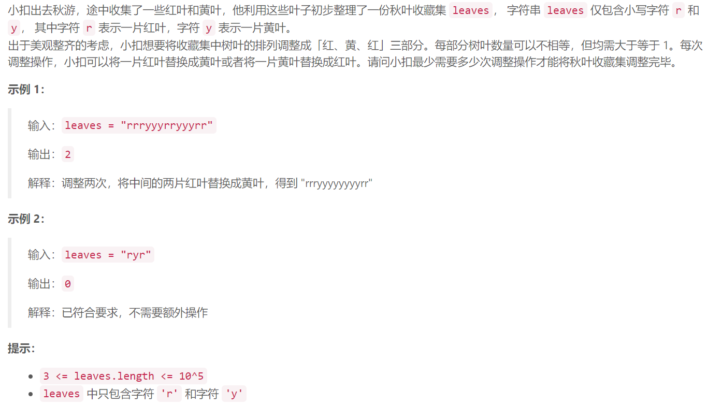

### 3.秋叶收藏集

  

## Java solution
```java
class Solution {
    // 红  黄 红 黄 红 黄
    // 3   9  2  4  1 3
    // 红 黄 红
    // 区域A(需要红) 区域B(需要黄)  区域C(需要红)  
    // 红A 黄A      红B 黄B       红C 黄C
    //调整 黄A+红B+黄C 
    //红B=redSum-红A-红C
    ////调整 黄A+redSum-红A-红C+黄C 
    //黄A-红A+黄C-红C 最小
    public int minimumOperations(String leaves) {
       int  n=leaves.length();
       int redSum=0,yellowSum=0; 
       int[] r1=new int[n];
       int[] y1=new int[n];
       int[] r2=new int[n]; 
       int[] y2=new int[n];
       int[] dp1=new int[n]; 
       int[] dp2=new int[n]; 
       char[] a=leaves.toCharArray(); 
       r1[0]=a[0]=='r'?1:0;
       y1[0]=a[0]=='y'?1:0;
       dp1[0]=y1[0]-r1[0];
       for(int i=1;i<n;i++)
       {
           r1[i]=r1[i-1]+(a[i]=='r'?1:0);
           y1[i]=y1[i-1]+(a[i]=='y'?1:0);
           dp1[i]=Math.min(y1[i]-r1[i],dp1[i-1]);
           //System.out.print(i+" "+r1[i]+" "+y1[i]+" "+dp1[i]+"\n");
       }
        redSum=r1[n-1];
        //System.out.print(l.get(n-1)[0]+" "+l.get(n-1)[1]+"\n");
       r2[n-1]=a[n-1]=='r'?1:0;
       y2[n-1]=a[n-1]=='y'?1:0;
        dp2[n-1]=y2[n-1]-r2[n-1];
        System.out.print(r2[n-1]+" "+y2[n-1]+" "+dp2[n-1]+"\n"); 
        for(int i=n-2;i>=0;i--)
       {
           r2[i]=r2[i+1]+(a[i]=='r'?1:0);
           y2[i]=y2[i+1]+(a[i]=='y'?1:0);
           dp2[i]=Math.min(y2[i]-r2[i],dp2[i+1]); 
            //System.out.print(i+" "+r2[i]+" "+y2[i]+" "+dp2[i]+"\n"); 
       }
        int res=n;
       for(int i=0;i<n-2;i++)
       {
           res=Math.min(dp1[i]+dp2[i+2],res);
       }
       return res+redSum; 
    }
}
```