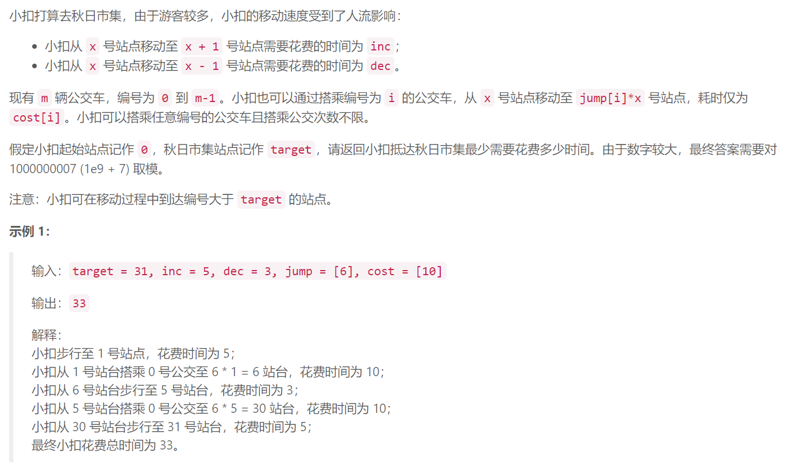
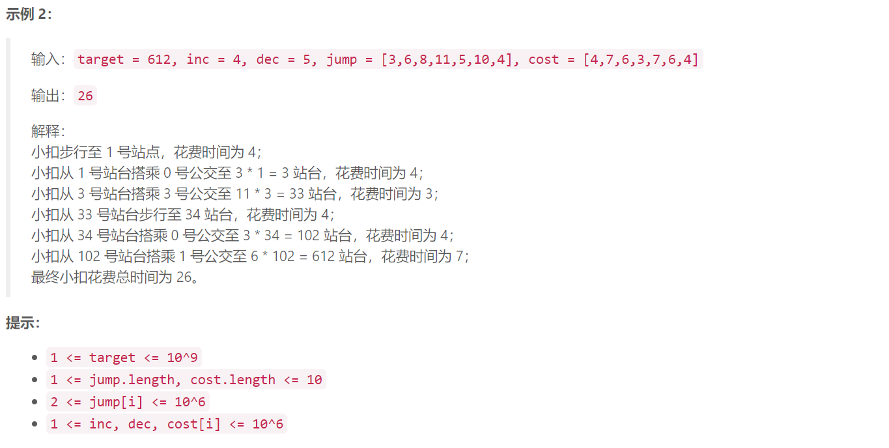

## 4. 快速公交





## Java solution

```java
class Solution {
    long mod=(long)(1e9+7);
    Map<Long,Long> map=new HashMap<>();
    public int busRapidTransit(int target, int inc, int dec, int[] jump, int[] cost) {
         return (int)(dfs((long)target,(long)inc,(long)dec,jump,cost)%mod);
    }
    private long dfs(long t, long inc, long dec, int[] jump, int[] cost)
    {
        //注意这里要对中间变量进行类型转换 因为最终结果是long型的
        if(map.containsKey(t)) return map.get(t);
        //对于target=t 总cost有三种可能 
        //(1)一步一步走到target 
        //(2)以某一放大系数j直接可以从t/j放大到t
        //(3)以某一放大系数j放大到离t最近的位置 再向前步进几步(比t小的最近位置)  或者向后走几步(比t大的最近位置)
        long res=t*inc;//情况(1)
        if(t<2) return res;
        for(int i=0;i<jump.length;i++)
        {
            long j=(long)jump[i],c=(long)cost[i];       
            long r=t%j;                   
            if(r==0) res=Math.min(res,dfs(t/j,inc,dec,jump,cost)+c);//情况(2)
            else res=Math.min(res,Math.min(inc*r+dfs(t/j,inc,dec,jump,cost)+c,dec*(j-r)+dfs(t/j+1,inc,dec,jump,cost)+c));//情况(3)
        }
        map.put(t,res);
        return res;
    }
}
```