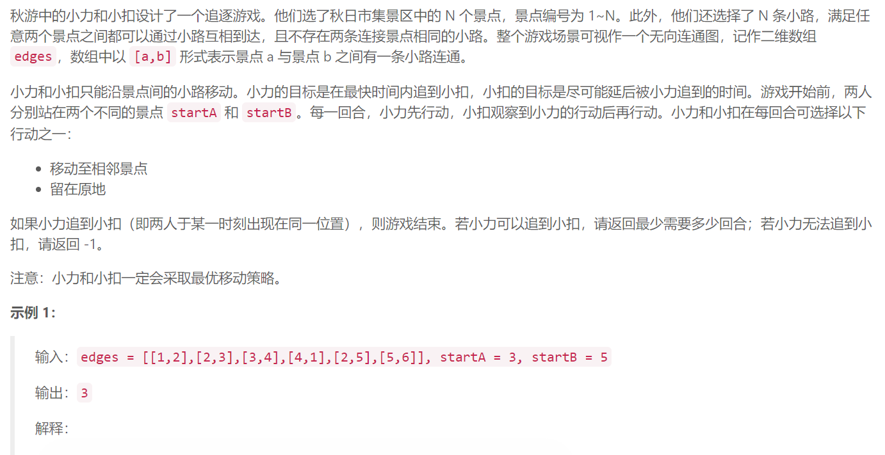
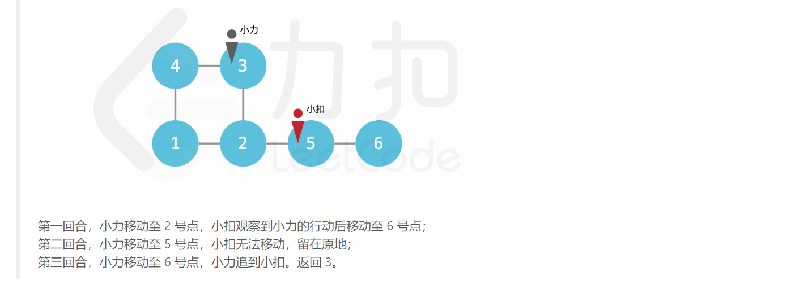
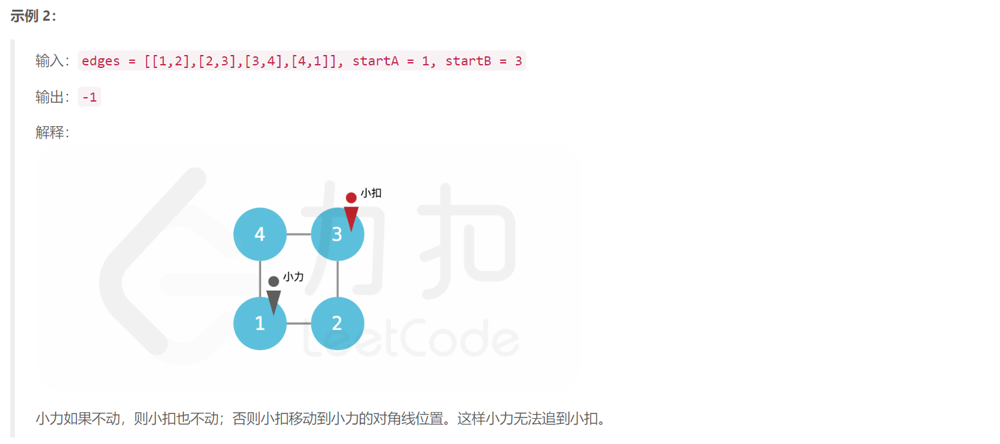
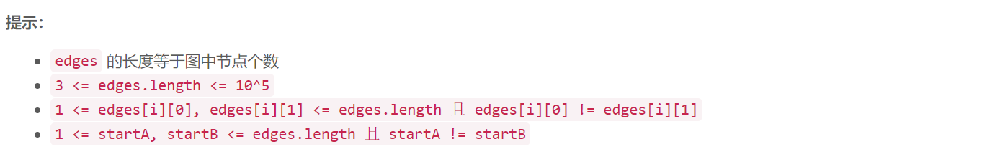

## 5. 追逐游戏



  





## Java solution

```java
class Solution {
    public int chaseGame(int[][] edges, int startA, int startB) {
       if(startA==startB) return 0;
       --startA;--startB;
        int n=edges.length;
        Set<String> set=new HashSet<>();
        
        for(int[] e:edges)
        {
            int e1=Math.min(e[0]-1,e[1]-1);
            int e2=Math.max(e[0]-1,e[1]-1);
            if(e1==e2) continue;
            set.add(e1+"_"+e2);
        }
        int e1=Math.min(startA,startB);
        int e2=Math.max(startA,startB);
        if(set.contains(e1+"_"+e2)) return 1;
        //System.out.print(set.size());
        List<Integer>[] l=new ArrayList[n];
        for(int i=0;i<n;i++) l[i]=new ArrayList<>();
        for(int[] e:edges)
        {  
            if(e[0]==e[1])continue;
            l[e[0]-1].add(e[1]-1);
            l[e[1]-1].add(e[0]-1);
        }
        int[] d1=bfs(l,startB);//startB到其余n-1个节点的距离 小扣
        int[] d2=bfs(l,startA);//startA到其余n-1个节点的距离 小力 先行动追小扣
        // 给定的图有两种情况 第一种是有一个环和单链(起点出度为1) 还有一种是只有一个环
        //有且只有一个环 因为只有n条边要连接所有节点
        if(set.size()==n)  //set存放所有边 (4,5) (5,4) 统一保存为4_5 这样如果向连两节点直接由两条边 set.size()<n 图中就不可能有环(只有N个节点)
        {
            Queue<Integer> q=new LinkedList<>();
            int[] adj=new int[n];
            for(int i=0;i<n;i++)adj[i]=l[i].size();
            for(int i=0;i<n;i++)
            {
                if(adj[i]==1) //出度==1的节点 单链的起点
                {
                    q.offer(i);
                    
                }
            }
            boolean[] visited=new boolean[n];//访问所有非环内节点visited[i]=true
            while(!q.isEmpty())
            {
                int cur=q.poll();
                visited[cur]=true;
                for(Integer i:l[cur])
                {
                    //如果某节点在单链上adj[i]-1 换上节点无论如何adj[i]>1 但是不在环上的节点在最后adj[i]=1
                    if((--adj[i])==1 && !visited[i])
                    {
                        q.offer(i); 
                    }
                }
            }
            int cnt=0;
            for(int i=0;i<n;i++)
            {
                if(!visited[i])cnt++;
            }
             //单链或者环的长度小于3那么一定能追上 
             //环的长度大于等于4 那么可能追不上
            if(cnt>=4)
            {
                for(int i=0;i<n;i++)
                {
                    //遍历所有环内节点 visited[i]=false 如果小力距离换上某节点距离比小扣距离该节点远1个单位以上 
                    //由于一次移动只能走一步 所以永远无法追上 
                    if(!visited[i] && d2[i]-d1[i]>1) return -1;
                }
            }
        }
        
        int res=0;
        for(int i=0;i<n;i++)
        {
            //System.out.print(i+" "+d1[i]+" "+d2[i]+"\n");
            //由于小力和小扣会采取最优策略 同时小力又无法一步追上小扣 所以小扣会向离小力最远的节点移动 
            //小力到达该节点的距离就是最少的移动步数
            if(d2[i]-d1[i]>1)res=Math.max(res,d2[i]);
        }
        return res;
    }
    private int[] bfs(List<Integer>[] l,int start)
    {
        int[] d=new int[l.length];
        Arrays.fill(d,-1);
        Queue<Integer> q=new LinkedList<>();
        q.offer(start);
        d[start]=0;
        while(!q.isEmpty())
        {
            int cur=q.poll();
            for(Integer n:l[cur])
            {
                if(d[n]==-1)
                {
                    d[n]=d[cur]+1;
                    q.offer(n);
                }
            }
        }
        return d;
    }
    
}
```