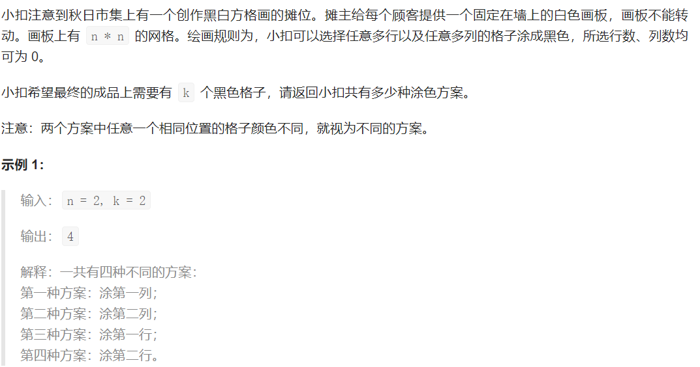
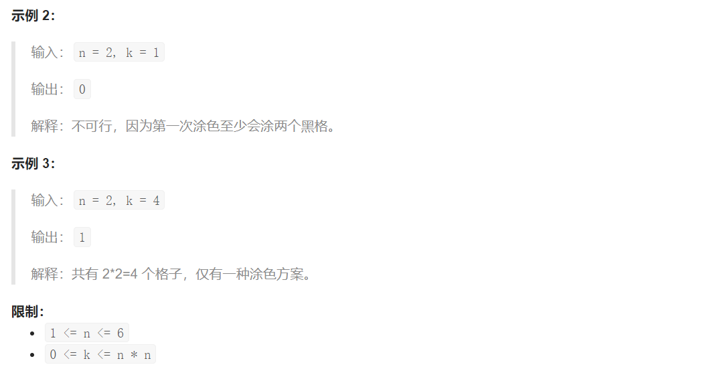

## LCP 22. 黑白方格画


  



## Java solution

```java
class Solution {
    public int paintingPlan(int n, int k) {
         int r=n*n-k; 
         if(r==0) return 1;
         int res=0;
         for(int i=1;i<=n;i++)for(int j=1;j<=n;j++)
         {
             if(i*j==r) 
             {
                 res+=combine(n,n-i)*combine(n,n-j);
             }
         }
         return res;
    }
    private int combine(int a,int b)
    {
        int num1=1;
        for(int i=1;i<=a-b;i++)num1*=i;
        int num2=1;
        for(int i=b+1;i<=a;i++)num2*=i;
        return num2/num1;
    }
}
```