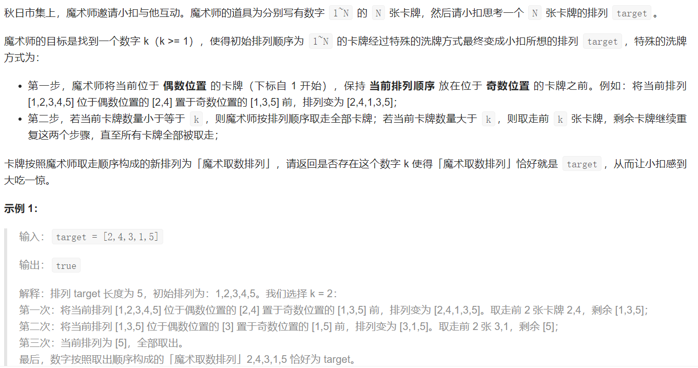
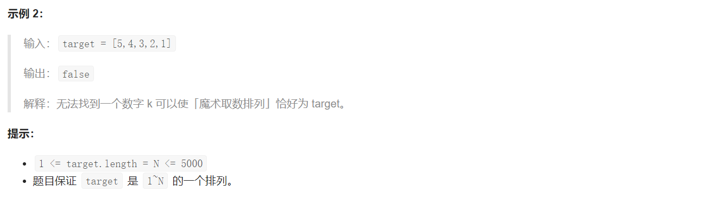

## LCP 23. 魔术排列

#### 

  

## Java solution
```java
class Solution {
    // 48-2=46/2=23+1=24  k=24
    public boolean isMagic(int[] target) {
         int N=target.length;
         Queue<Integer> q=new LinkedList<>();
         for(int i=1;i<=N;i++)q.offer(i);
         int cnt=0;
         int j=0,k=0;
         while(!q.isEmpty())
         {
             Queue<Integer> q1=new LinkedList<>();
             Queue<Integer> q2=new LinkedList<>();
             int size=q.size();
             for(int i=0;i<size;i++)
             {
                 if(i%2==0)q2.offer(q.poll());
                 else q1.offer(q.poll());
             }
             while(!q2.isEmpty()) q1.offer(q2.poll());
             if(cnt==0)
             {
                 int i;
                 for(i=0;j<N&&target[j]==q1.peek();j++,i++)
                 {
                   q1.poll();
                 }
                 if(i==0) return false;
                 k=i;
                 //k只能等于最大的前缀匹配长度
                 //解释见:https://leetcode-cn.com/problems/er94lq/solution/mo-ni-xi-pai-guo-cheng-xiang-xi-fen-xi-li-jie-kde-/
             }
             else
             {
                 int i;
                 for(i=0;j<N&&i<k&&target[j]==q1.peek();j++,i++){
                   q1.poll();
                 }
                 if(j<N && i<k) return false;
             } 
             cnt++;
             q=q1;
         }
         return true;
    }
}
```