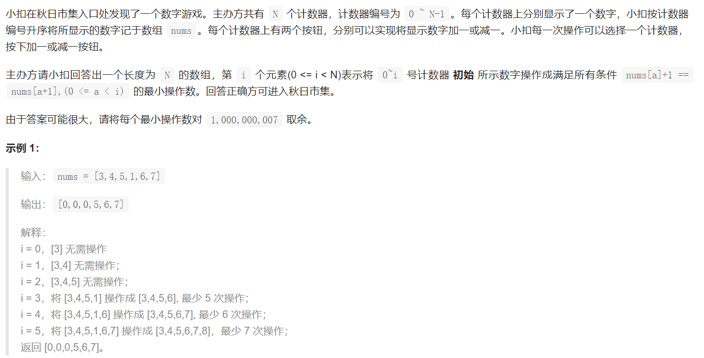
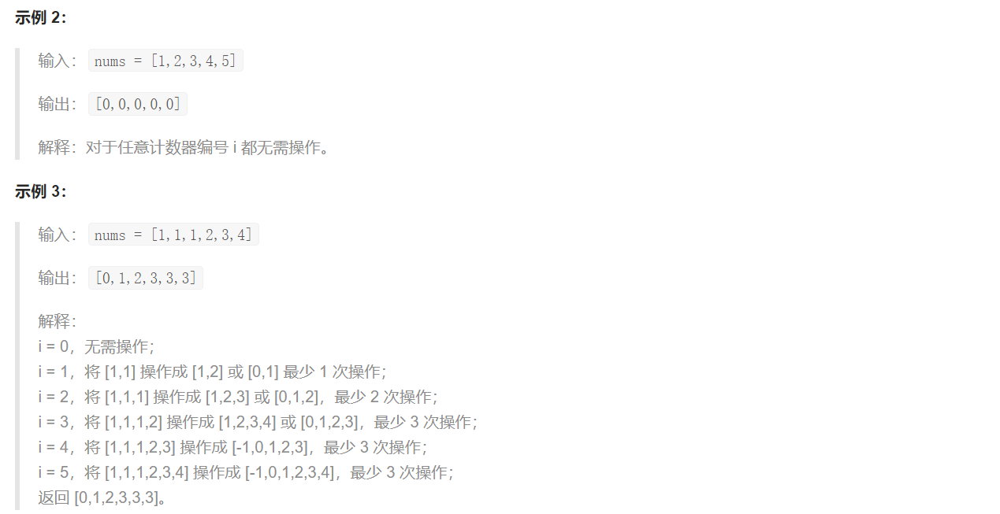
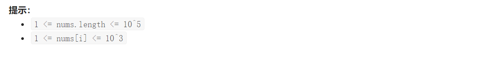

## LCP 24. 数字游戏

  





## Java solution

```java
//题解 https://leetcode-cn.com/problems/5TxKeK/solution/java-deng-tong-yu-qiu-shu-ju-liu-de-zhong-wei-shu-/
class Solution {
    long mod=(long)1e9+7;
    public int[] numsGame(int[] nums) {
       int n=nums.length; 
       long[] num=new long[n]; 
       int[] res=new int[n];
       for(int i=0;i<n;i++)num[i]=(long)nums[i]-(long)i;
       MedianFinder m=new MedianFinder();
       m.addNum(num[0]);
       for(int i=1;i<n;i++)
       {
           m.addNum(num[i]);
           long median=m.getMedian();
           //1 2 3 4 5 6  minSum=15 maxSum=6 median=4 value=15-4*3+4*3-6
          //1 2 3 4 5   minSum=12 maxSum=3 median=3 value=12-3*3+2*3-3
          //注意这里minHeap和maxHeap中包含了Integer.MAX_VALUE和Integer.MIN_VALUE 所以size()-1
          
           long value=m.minSum-median*(m.minHeap.size()-1)+median*(m.maxHeap.size()-1)-m.maxSum;
           res[i]=(int)(value%mod);
       }
       return res;
    }
}

class MedianFinder
{
    long minSum,maxSum;
    PriorityQueue<Long> minHeap,maxHeap;
    MedianFinder()
    {
        minSum=0;
        maxSum=0;
        minHeap=new PriorityQueue<>();
        maxHeap=new PriorityQueue<>(
            (a,b)->
            {
                if(b>a) return 1;
                if(b<a) return -1;
                return 0; 
            }
        );
        minHeap.offer(Long.MAX_VALUE);
        maxHeap.offer(Long.MIN_VALUE);
    }
    void adjust()
    {
        if(minHeap.size()-maxHeap.size()>=2)
        {
            long num=minHeap.poll();
            minSum-=num;
            maxHeap.offer(num);
            maxSum+=num;
        }
        if(maxHeap.size()-minHeap.size()>=2)
        {
            long num=maxHeap.poll();
            maxSum-=num;
            minHeap.offer(num);
            minSum+=num;
        }
    }
    void addNum(long num)
    {
        if(num<maxHeap.peek())
        {
            maxHeap.offer(num);
            maxSum+=num;
        }
        else {
            minHeap.offer(num);
            minSum+=num;
        }
        adjust();
    }
    long getMedian()
    {
       if(maxHeap.size()>minHeap.size())return maxHeap.peek();
       else return minHeap.peek();
    }
}
```