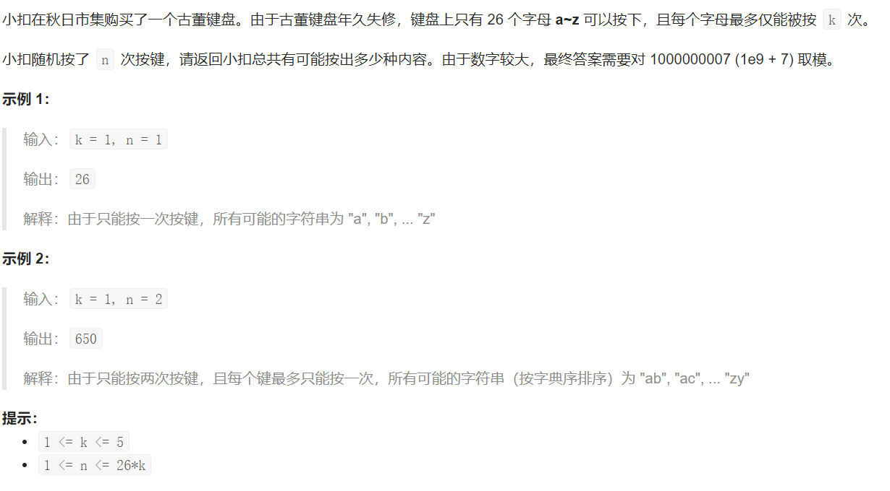

## LCP 25. 古董键盘



## Java solution

```java
class Solution {
    long M=(long)1e9+7;
    public int keyboard(int k, int n) {
      long[][] C=new long[n+1][n+1];
      //组合数递推公式 c(i,j)=c(i-1,j-1)+c(i-1,j)  
      for(int i=0;i<=n;i++) C[i][0]=1 ;
      for(int i=1;i<=n;i++)for(int j=1;j<=i;j++)
      {
          C[i][j]=C[i-1][j-1]+C[i-1][j];
      }
      long[][] dp=new long[27][n+1];//dp[ch][j] 表示用了前ch个字符(1对应'a' 3对应'a' 'b' 'c') 剩余j个空可以填
      dp[0][n]=1;//没有用任何字符 同时剩余n个位置没有填的方案数为1  
      for(int i=0;i<26;i++)
      {
          for(int j=n;j>=0;j--)for(int l=0;l<=k && l<=j;l++)
          {
              //假设有10个位置 3个位置放a 那么方案数是c(10,3) 在剩余位置中放4个b 那么方案数是c(7,4) 总的方案数是c(10,3)*c(7,4)
              //dp[i+1][j]=dp[i+1][j]+dp[i][j]*C[j][0] l=0 表示使用了新的子母 但是并没有实际按下  这里C[j][0]=1 所以新增的方法数是dp[i][j]
              
              dp[i+1][j-l]=(dp[i+1][j-l]+dp[i][j]*C[j][l])%M;
          }
      }
      
      return (int)(dp[26][0]%M);//使用了前26个字符 同时没有剩余位置  
    }
    
}

```