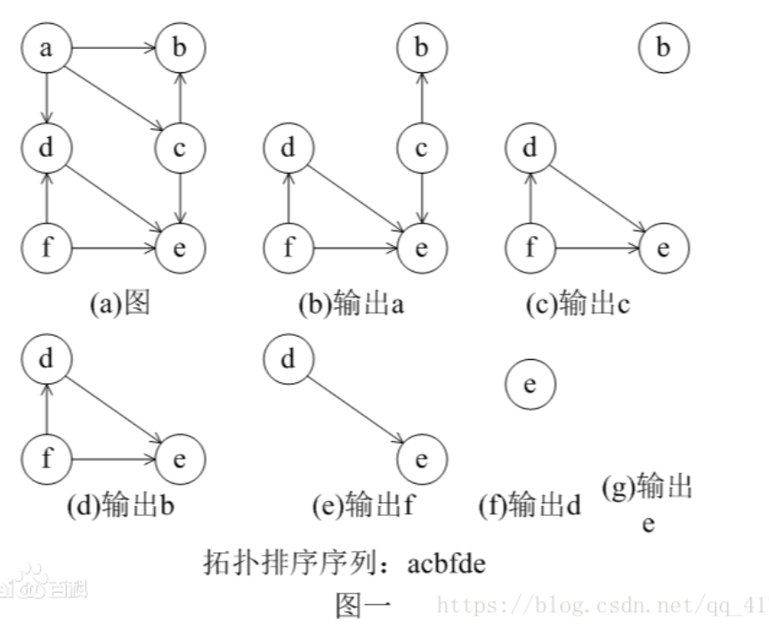

## 拓扑排序

在一个有向图中，对所有的节点进行排序，要求没有一个节点指向它前面的节点。

先统计所有节点的入度，对于入度为0的节点就可以分离出来，然后把这个节点指向的节点的入度减一。

一直做改操作，直到所有的节点都被分离出来。

如果最后不存在入度为0的节点，那就说明有环，不存在拓扑排序，也就是很多题目的无解的情况。

下面是算法的演示过程。



```java
public TopologicalSort (int n, int[][] edges) {
    
        int[] inDegree=new int[n];// 记录每个节点的出度
        List<Integer>[] t=new List[n];
        for(int i=0;i<n;i++) t[i]=new ArrayList<>();
        for(int[] e:edges)
        {
             t[e[0]].add(e[1]);
             t[e[1]].add(e[0]);
             inDegree[e[0]]++;
             inDegree[e[1]]++;
        }
        /*以上构图的内容可能会有变化1比如变成有向图*/
      
        Queue<Integer> q=new LinkedList<>();
        /*把所有出度为1的节点，也就是叶子节点入队*/
        for(int i=0;i<n;i++) if(inDegree[i]==1) q.offer(i);
        while(!q.isEmpty())
        {
            int SIZE=q.size();
            res=new ArrayList<>();
            for(int i=0;i<SIZE;i++)
            {
                int cur=q.poll();
                inDegree[cur]--;//队列中节点出度都是1 这里将inDegree[cur]置为1 表示删除节点
                for(Integer k:t[cur]) 
                {  
                   if(inDegree[k]>0)
                   {
                     
                     inDegree[k]--; 
                     if(inDegree[k]==1) q.offer(k);//将新的叶节点入队
                   } 
                }
            }
        }
    }
```

