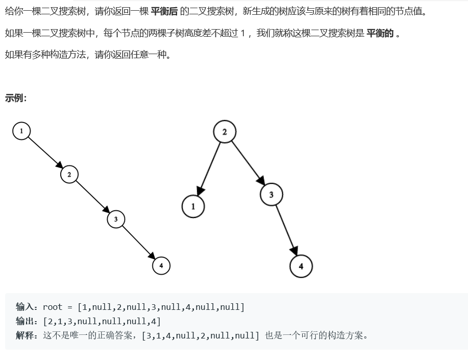

# 5179. 将二叉搜索树变平衡


  

  
## java solution
```java
/**
 * Definition for a binary tree node.
 * public class TreeNode {
 *     int val;
 *     TreeNode left;
 *     TreeNode right;
 *     TreeNode(int x) { val = x; }
 * }
 */
class Solution {
    public TreeNode balanceBST(TreeNode root) {
          List<TreeNode> nodes=new ArrayList<TreeNode>();
          Stack<TreeNode> s=new Stack<TreeNode>();
          
          while(root!=null||!s.isEmpty())
          {
              while(root!=null)
              {
                  s.push(root);
                  root=root.left;
              }
              if(!s.isEmpty())
              {
                  root=s.pop();
                  nodes.add(root);
                  root=root.right;
              }
          }
        
        return helper(nodes,0,nodes.size()-1);
        
          
    }
    public TreeNode helper(List<TreeNode> nodes,int i,int j)
    {
        if(i>j) return null;
        int temp=(i+j)/2;
        TreeNode node=nodes.get(temp);
        node.left=helper(nodes,i,temp-1);
        node.right=helper(nodes,temp+1,j);
        
        return node;
    }
}
```