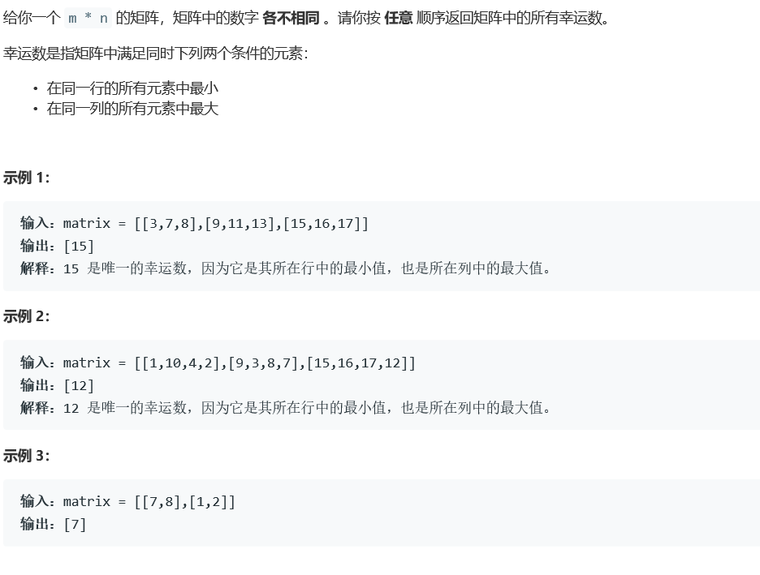
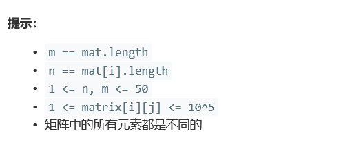

# 5356. 矩阵中的幸运数


  

  
## java solution
```java
class Solution {
    public List<Integer> luckyNumbers (int[][] matrix) {
        List<Integer> res=new ArrayList<Integer>();
        int n=matrix.length,m=matrix[0].length;
        //List<Pair<Integer, Integer>> max = new ArrayList<Pair<Integer, Integer>>();
        int min;
        int i1,j1;
        for(int i=0;i<n;i++)
        {
            i1=i;j1=0;
            min=100001;
            for(int j=0;j<m;j++)
            {
                if(matrix[i][j]<min)
                {
                    min=matrix[i][j];
                    i1=i;
                    j1=j;
                } 
                //System.out.print(min);
                //System.out.print(matrix[i][j]);
            }

            if(isLuckyNumber(matrix,i1,j1))
            {
              res.add(matrix[i1][j1]);
            }
        }
        return res;
    }
    public boolean isLuckyNumber(int[][] matrix,int i1,int j1)
    {
        int n=matrix.length;
        for(int i=0;i<n;i++)
        {
            if(i==i1) continue;
            if(matrix[i][j1]>matrix[i1][j1]) return false;
        }
        return true;
    }
}
```