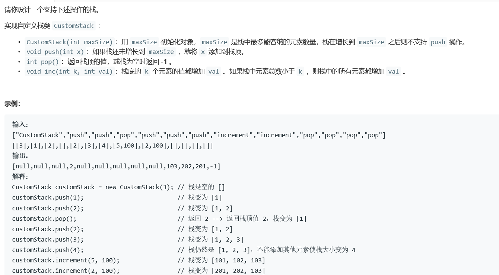
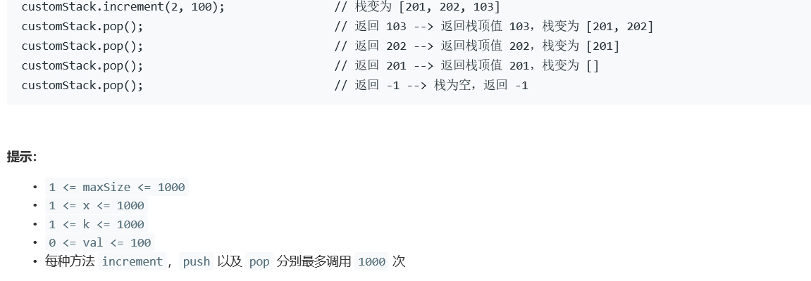

# 5357. 设计一个支持增量操作的栈


  

  
## java solution
```java
class CustomStack {
    int size=0;
    int cnt=0;
    List<Integer> list=new ArrayList<Integer>();
    public CustomStack(int maxSize) {
      size=maxSize;
    }
    
    public void push(int x) {
      if(cnt==size) return;
       list.add(x); 
        cnt++;
    }
    
    public int pop() {
      if(cnt==0) return -1;
      int temp=list.get(cnt-1);
      list.remove(--cnt);
      return temp;  
    }
    
    public void increment(int k, int val) {
       for(int i=0;i<(cnt<k?cnt:k);i++)
       {
           int temp=list.get(i);
           list.set(i,temp+val);
       }
    }
}

/**
 * Your CustomStack object will be instantiated and called as such:
 * CustomStack obj = new CustomStack(maxSize);
 * obj.push(x);
 * int param_2 = obj.pop();
 * obj.increment(k,val);
 */
```