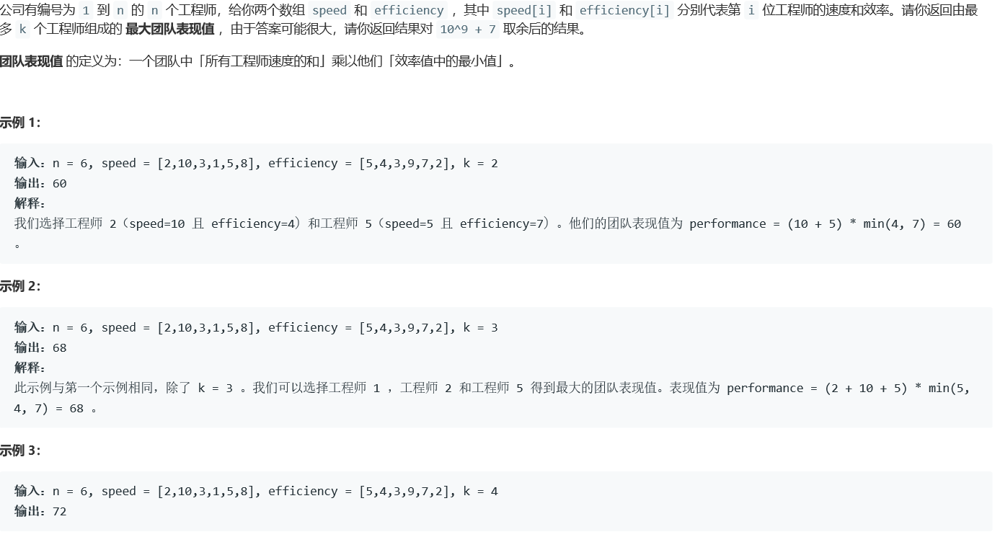
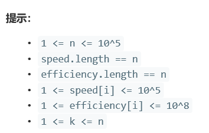

# 5359. 最大的团队表现值


  

  
## java solution
```java
class Solution {
    //直观的解法是按照效率进行降序排序，每个人作为最低效率时，在其左侧找出至多K个最大速度即可，这一过程可以用堆，时间复杂度O(nlgk) lgk是因为要维护优先级队列
    public int maxPerformance(int n, int[] speed, int[] efficiency, int k) {
      int[][] items=new int[n][2];
       for(int i=0;i<n;i++)
       {
           items[i][0]=speed[i];
           items[i][1]=efficiency[i];
       }
       Arrays.sort(items,new Comparator<int[]>()
       {
           @Override
           public int compare(int a[],int b[])
           {
               return b[1]-a[1];//降序排列
           }
       });
       PriorityQueue<Integer> queue=new PriorityQueue<Integer> ();
       long res=0,sum=0;
       for(int i=0;i<n;i++)
       {
         queue.add(items[i][0]);
         sum+=items[i][0];
         if(queue.size()>k)
         {
             sum-=queue.poll();
         }
         res=Math.max(res,sum*items[i][1]);
       }
       
       return (int)(res % (int)(1e9+7));
       
    }
}


```