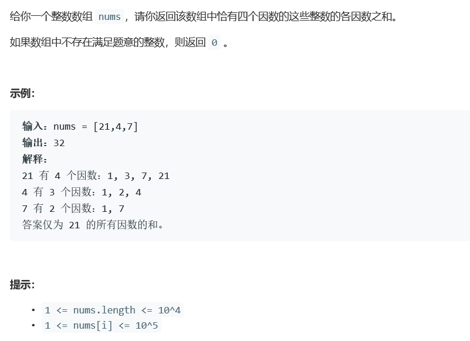

# 5178. 四因数


  


## c++ solution
```c++
class Solution {
public:
    //68ms 8.9MB
    //某数若只有两个因数，则说明该数除了1和它只有两个因子
    //这两个因数的值在[2,sqrt(num)] 和[sqrt(num,num-1)]之间
    //若[2,sqrt(num)]内只有一个数可以整除，则说明只有四个因数
    //需要注意sqrt(num)为整数的情况 用num1*num1!=num 将其排除
    int sumFourDivisors(vector<int>& nums) {
        int size=nums.size();
        int sum=0;
        for(int i=0;i<size;i++)
        {
           sum+=helper(nums[i]);
        }
        return sum;
    }
    int helper(int num)
    {
        if(num<6) return 0;
        int num1=0;
        int cnt=0;
        for(int i=2;i<(int)sqrt(num)+1;i++)
        {
            if(num%i==0)
            {
                num1=i;
                cnt++; 
            }
        }
        return cnt==1&&num1*num1!=num?1+num+num1+num/num1:0;
    }
};
```