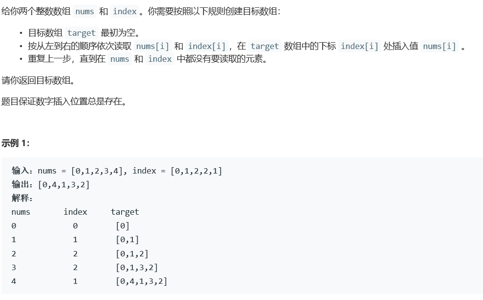
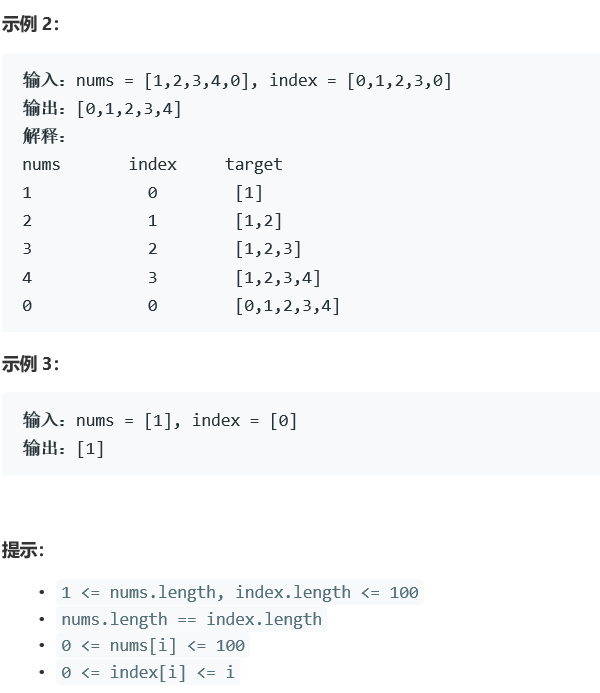

# 5364. 按既定顺序创建目标数组


  

  
## c++ solution
```c++
class Solution {
public:
    vector<int> createTargetArray(vector<int>& nums, vector<int>& index) {
        vector<int> res;
        int size=nums.size();
        for(int i=0;i<size;i++)
        {
            vector <int>::iterator theIterator = res.begin(); 
            if(index[i]==i)
            {
                res.push_back(nums[i]);
            }
            else
            {
                res.insert(theIterator+index[i],nums[i]);//向量中迭代器指向元素前增加一个元素x
            }
        }
        return res;
    }
};
```