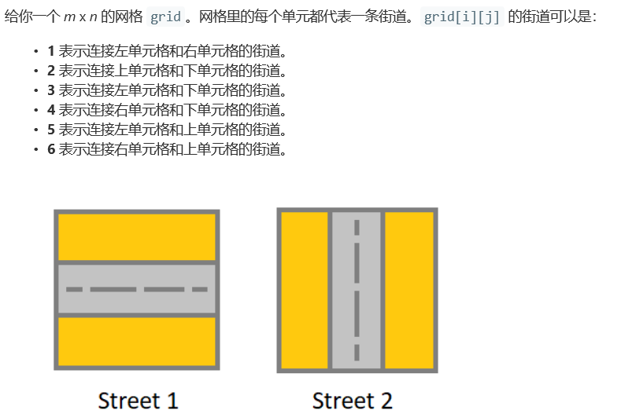
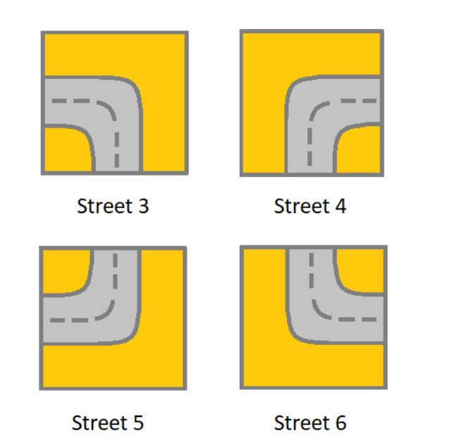
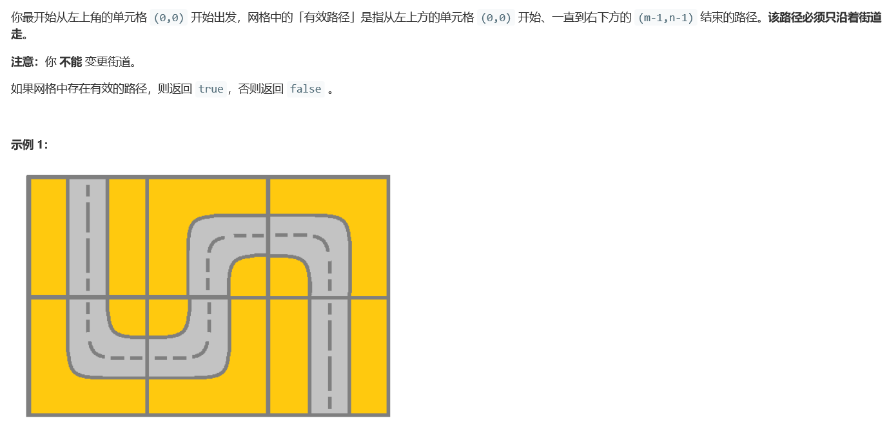
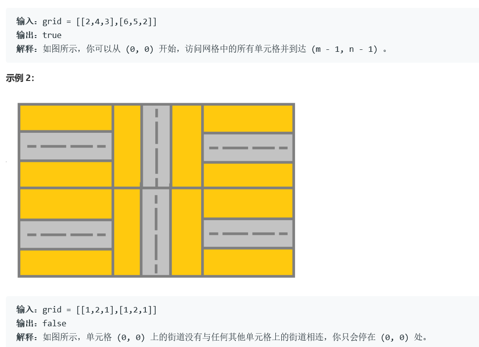
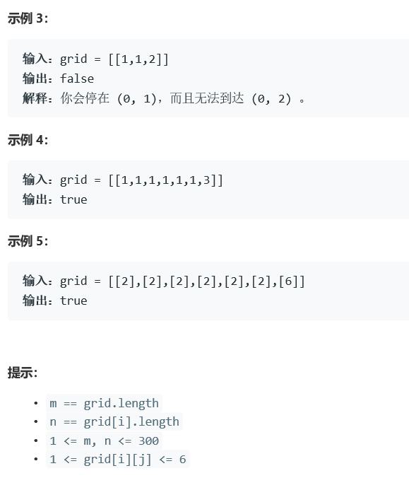

# 5357. 设计一个支持增量操作的栈


  

    

  

 

  


## c++ solution
```c++
/*
class Solution {
public:

    //direction up--1 down--2 left--3 right--4
    //220ms 26.8MB
    enum direction_set {no_direction, up,down, left,right};
    bool hasValidPath(vector<vector<int>>& grid) {
        if(grid.size()==1&&grid[0].size()==1) return true;
        return helper(grid,0,0,no_direction);
    }
    bool helper(vector<vector<int>>& grid,int i,int j,direction_set direction)
    {
        int row=grid.size(),col=grid[0].size();
        if(i==row||j==col||i==-1||j==-1) return false;
        switch(grid[i][j])
        {
            case 1:
            {
              if(direction==no_direction)
              {
                  return helper(grid,i,j+1,right);
              }
              else if(direction==right)
              {
                  if(i==row-1&&j==col-1) return true;
                  return helper(grid,i,j+1,right);
              }
              else if(direction==left)
              {
                  if(i==row-1&&j==col-1) return true;
                  return helper(grid,i,j-1,left);
              }
              else
              {
                  return false;
              }
            }
            case 2:
            {
              if(direction==no_direction)
              {
                  return helper(grid,i+1,j,down);
              }
              else if(direction==up)
              {
                  if(i==row-1&&j==col-1) return true;
                  return helper(grid,i-1,j,up);
              }
              else if(direction==down)
              {
                  if(i==row-1&&j==col-1) return true;
                  return helper(grid,i+1,j,down);
              }
              else
              {
                  return false;
              }
            }
            case 3:
            {
              if(direction==no_direction)
              {
                  return helper(grid,i+1,j,down);
              }
              else if(direction==right)
              {
                  if(i==row-1&&j==col-1) return true;
                  return helper(grid,i+1,j,down);
              }
              else if(direction==up)
              {
                  if(i==row-1&&j==col-1) return true;
                  return helper(grid,i,j-1,left);
              }
              else
              {
                  return false;
              }
            }
            case 4:
            {
              if(direction==no_direction)
              {
                  return helper(grid,i+1,j,down)||helper(grid,i,j+1,right);
              }
              else if(direction==up)
              {
                  if(i==row-1&&j==col-1) return true;
                  return helper(grid,i,j+1,right);
              }
              else if(direction==left)
              {
                  if(i==row-1&&j==col-1) return true;
                  return helper(grid,i+1,j,down);
              }
              else
              {
                  return false;
              }
            }
            case 5:
            {
              if(direction==no_direction)
              {
                  return false;
              }
              else if(direction==right)
              {
                  if(i==row-1&&j==col-1) return true;
                  return helper(grid,i-1,j,up);
              }
              else if(direction==down)
              {
                  if(i==row-1&&j==col-1) return true;
                  return helper(grid,i,j-1,left);
              }
              else
              {
                  return false;
              }
            }
            case 6:
            {
              if(direction==no_direction)
              {
                  return helper(grid,i,j+1,right);
              }
              else if(direction==down)
              {
                  if(i==row-1&&j==col-1) return true;
                  return helper(grid,i,j+1,right);
              }
              else if(direction==left)
              {
                  if(i==row-1&&j==col-1) return true;
                  return helper(grid,i-1,j,up);
              }
              else
              {
                  return false;
              }
            }
            default:return false;
        }
        return false;
    }
    
};*/

class Solution {
    int m,n,dx[4]={1,0,-1,0},dy[4]={0,1,0,-1};//0下、1右、2上、3左
    int pipe[7][4]={{-1,-1,-1,-1},{-1,1,-1,3},{0,-1,2,-1},{-1,0,3,-1},{-1,-1,1,0},{3,2,-1,-1},{1,-1,-1,2}};
    //记录各个拼图块路径的方向，0、1、2、3代表方向，-1代表不可走。
    bool dfs(int x,int y,int dir,vector<vector<int>>& grid){//(x,y,当前方向,地图)
        if(x==m-1&&y==n-1) return 1;//到达终点
        int xx=x+dx[dir];
        int yy=y+dy[dir];//得到下一个准备走的坐标
        if(xx<0||yy<0||xx>=m||yy>=n)return 0;//越界
        int nxt=grid[xx][yy];//得到下一块拼图的编号
        if(pipe[nxt][dir]!=-1)return dfs(xx,yy,pipe[nxt][dir],grid);//如果当前方向可走，则方向改变，继续走。
        return 0;//无法走，返回0
    }
    public:
    bool hasValidPath(vector<vector<int>>& grid) {    
        m=grid.size();
        n=grid[0].size();
        int sta=grid[0][0];//起点的拼图编号
        for(int i=0;i<4;++i)//朝着四个方向都试一下
            if(pipe[sta][i]!=-1)//当前方向可以走
                if(dfs(0,0,pipe[sta][i],grid))//沿着当前方向搜索
                    return 1;//拼图都有两个方向可以走，只要沿着一个初始方向走通就可以。
        return 0;
    }
};
```