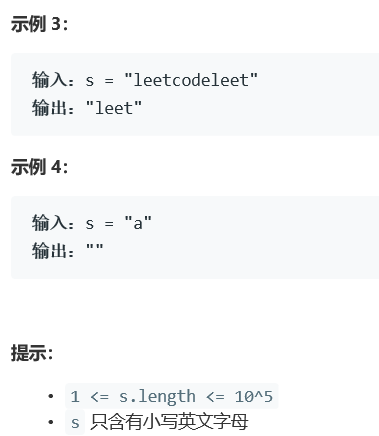

# 5367. 最长快乐前缀


  

  
## c++ solution
```c++
class Solution {
public:
    string longestPrefix(string s) {
        int next[s.size()+1]={0};
        next[0]=-1;
        int j=-1,i=0;
        while(i<s.size())
        {
          printf("%d,%d,%d\n",i,j,next[i]);  
          //// 已有 [0, ..., j - 1] 与 [i - j, ..., i - 1] 匹配, 同时 s[j] == s[i]
          if(j==-1||s[i]==s[j])
          {
              next[++i]=++j;
              // 匹配长度增加 1, 查看下一个匹配位置
          }
          else
          {
              j=next[j];
              // // 不匹配, 说明当前查看的前缀太长, 将 j 跳回到上一个可能的匹配位置
          }
        }
        return s.substr(0,next[s.size()]);
    }
};


```  


