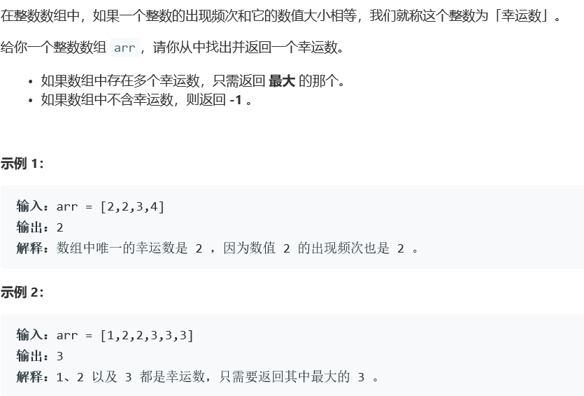
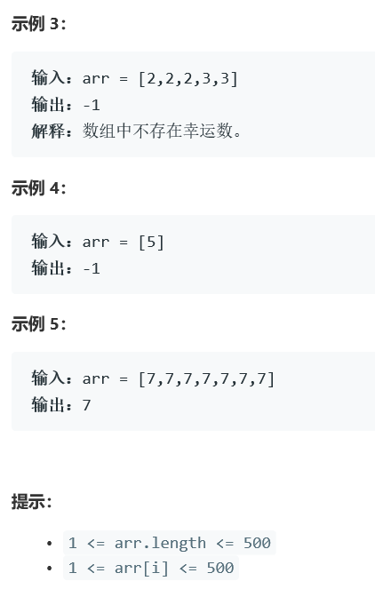

# 5368. 找出数组中的幸运数


    

  


## java solution
```java
class Solution {
    public int findLucky(int[] arr) {
         int[] cnt=new int[501];
         int len=arr.length;
         for(int i=0;i<len;i++)
         {
             cnt[arr[i]]++;
         }
        for(int i=500;i>=1;i--)
        {
            if(cnt[i]==i) return i;
        }
        return -1;
    }
}
```