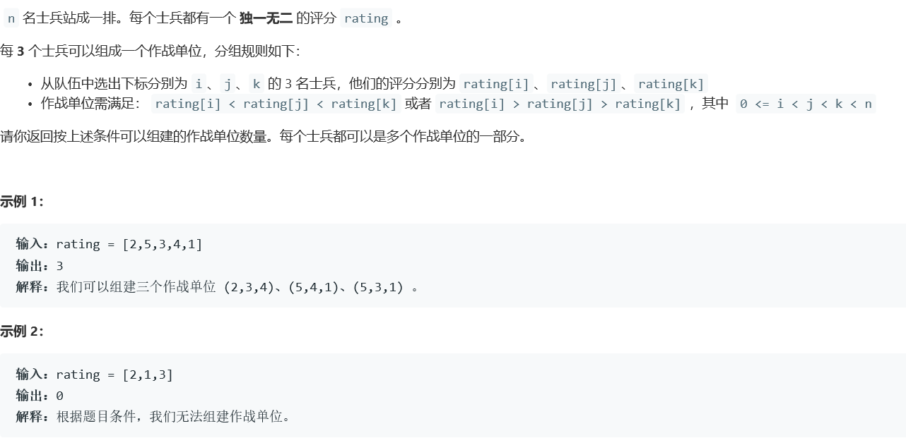
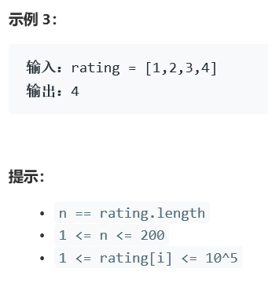

# 5369. 统计作战单位数


  

    


## c++ solution
```c++
class Solution {
    public int numTeams(int[] rating) {
        int len=rating.length;
        if(len<3) return 0;
        int cnt=0;
        int[] dp1=new int[len];
        int[] dp2=new int[len];
        for(int i=0;i<len-1;i++)
        {
            for(int j=i+1;j<len;j++)
            {
                if(rating[j]>rating[i])dp1[i]++;
                if(rating[j]<rating[i])dp2[i]++;
            }
        }
        
        for(int i=0;i<len-2;i++)
        {
            if(dp1[i]<2&&dp2[i]<2)continue;
            for(int j=i+1;j<len-1;j++)
            {
                if(rating[j]>rating[i]) cnt+=dp1[j];
                if(rating[j]<rating[i]) cnt+=dp2[j];
            }
        }
        return cnt;
    }
}
```