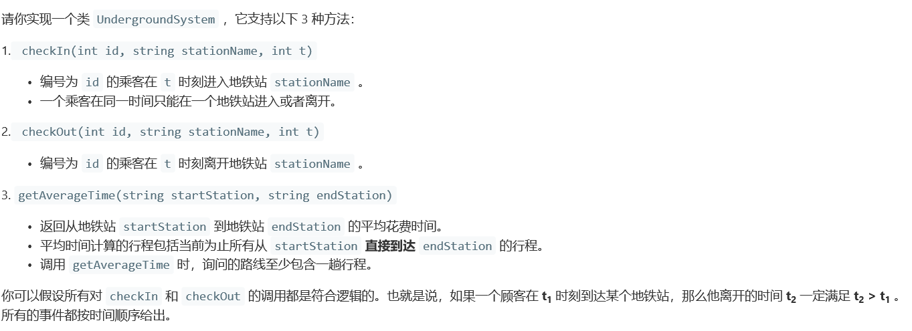
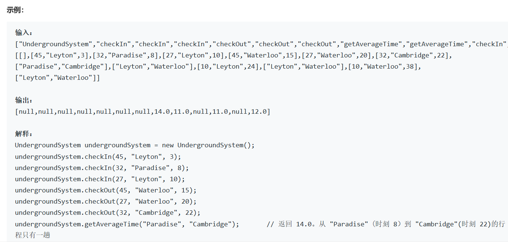
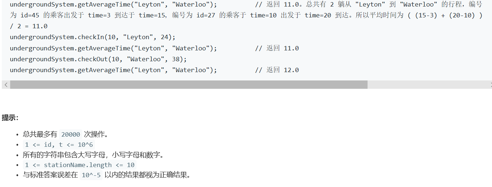

# 5370. 设计地铁系统


  

    

    

## java solution
```java
class UndergroundSystem {
    HashMap<String ,HashMap<Integer,Integer>> map1 = new HashMap<>();  
    HashMap<String ,HashMap<Integer,Integer>> map2 = new HashMap<>();  
    public UndergroundSystem() {

    }
    
    public void checkIn(int id, String stationName, int t) {
       if(map1.containsKey(stationName))
       {
           HashMap<Integer,Integer> stationMap=map1.get(stationName);
           stationMap.put(id,t);
           map1.put(stationName,stationMap);
       }
       else
       {
           HashMap<Integer,Integer> stationMap=new HashMap<>(); 
           stationMap.put(id,t);
           map1.put(stationName,stationMap);
       }
    }
    
    public void checkOut(int id, String stationName, int t) {
        if(map2.containsKey(stationName))
       {
           HashMap<Integer,Integer> stationMap=map2.get(stationName);
           stationMap.put(id,t);
           map2.put(stationName,stationMap);
       }
       else
       {
           HashMap<Integer,Integer> stationMap=new HashMap<>(); 
           stationMap.put(id,t);
           map2.put(stationName,stationMap);
       }
    }
    
    public double getAverageTime(String startStation, String endStation) {
        double res=0.0;
        long sum=0;
        int cnt=0;
        if(map1.containsKey(startStation)&&map2.containsKey(endStation))
        {
            HashMap<Integer,Integer> station1=map1.get(startStation);
            HashMap<Integer,Integer> station2=map2.get(endStation);
            for(Integer id:station1.keySet())
            {
                if(station2.containsKey(id))
                {
                    ++cnt;
                    sum+=station2.get(id)-station1.get(id);
                }
            }
        }
        return (double)((sum+0.0)/cnt);
    }
}

/**
 * Your UndergroundSystem object will be instantiated and called as such:
 * UndergroundSystem obj = new UndergroundSystem();
 * obj.checkIn(id,stationName,t);
 * obj.checkOut(id,stationName,t);
 * double param_3 = obj.getAverageTime(startStation,endStation);
 */
```