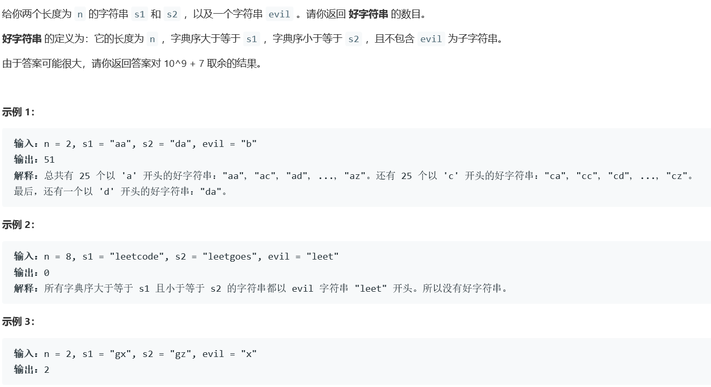
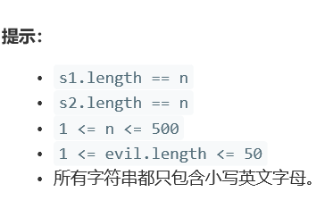
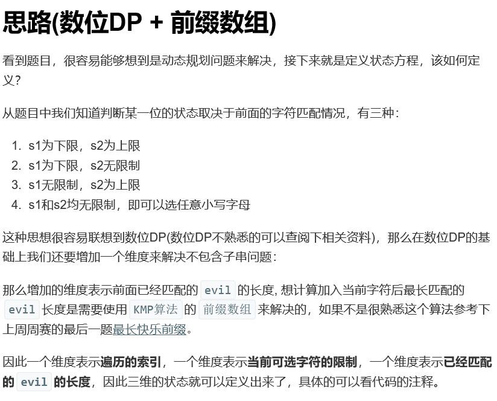

# 5367. 最长快乐前缀


  

     

   


## java solution
```java
// time complxity O(n * m * m * 26)
class Solution {

  public int findGoodStrings(int n, String s1, String s2, String evil) {
    int mod = (int) 1e9 + 7;
    int m = evil.length();
    long[][][] dp = new long[n + 1][4][m + 1]; // 第二维度中， 0表示s1和s2都有限制，1表s1有限制， 2表示s2有限制， 3表示s1和s2无限制； 第三维度表示前面已经匹配的evil的长度
    // 初始化
    for (int i = 0; i < m; i++) {
      dp[n][0][i] = 1;
      dp[n][1][i] = 1;
      dp[n][2][i] = 1;
      dp[n][3][i] = 1;
    }
    char[] p = evil.toCharArray();
    int[] prefix = calcuPrefixFunction(p); // O(n)，计算前缀数组
    for (int i = n - 1; i >= 0; i--) {
      for (int j = 0; j < m; j++) {
        // handle 0
        for (char k = s1.charAt(i); k <= s2.charAt(i); k++) {
          int state = 0;
          if (k == s1.charAt(i) && k == s2.charAt(i)) {
            state = 0;
          } else if (k == s1.charAt(i)) {
            state = 1;
          } else if (k == s2.charAt(i)) {
            state = 2;
          } else {
            state = 3;
          }
          //getNext只有当前p[0]--p[j]全部匹配才会返回j++,否则返回某个前缀小于j因此加上的dp=1 注意dp[n][3][m]=0
          //也就是说和evil匹配的部分会返回0
          dp[i][0][j] += dp[i + 1][state][getNext(prefix, p, k, j)];
          dp[i][0][j] %= mod;
        }
        // handle 1
        for (char k = s1.charAt(i); k <= 'z'; k++) {
          int state = k == s1.charAt(i) ? 1 : 3;
          dp[i][1][j] += dp[i + 1][state][getNext(prefix, p, k, j)];
          dp[i][1][j] %= mod;
        }
        //handle 2
        for (char k = 'a'; k <= s2.charAt(i); k++) {
          int state = k == s2.charAt(i) ? 2 : 3;
          dp[i][2][j] += dp[i + 1][state][getNext(prefix, p, k, j)];
          dp[i][2][j] %= mod;
        }
        // handle 3
        for (char k = 'a'; k <= 'z'; k++) {
          int state = 3;
          dp[i][3][j] += dp[i + 1][state][getNext(prefix, p, k, j)];
          dp[i][3][j] %= mod;
        }
      }
    }
    return (int) dp[0][0][0];
  }

  private int[] calcuPrefixFunction(char[] p) { // 考虑边界情况， 即p的长度为0
    int n = p.length;
    int[] prefixArray = new int[n];  // 表示匹配的长度结果
    prefixArray[0] = 0;
    int j = 0;  // len of match string 表示匹配的长度
    for (int i = 1; i < n; i++) {
      while (j > 0 && p[i] != p[j]) {
        j = prefixArray[j - 1];
      }
      if (p[i] == p[j]) {
        j++;
      }
      prefixArray[i] = j;
    }
    return prefixArray;
  }

  private int getNext(int[] prefix, char[] p, char c, int j) {
    while (j > 0 && c != p[j]) {
      j = prefix[j - 1];
    }
    if (c == p[j]) {
      j++;
    }
    return j;
  }
}


```  


