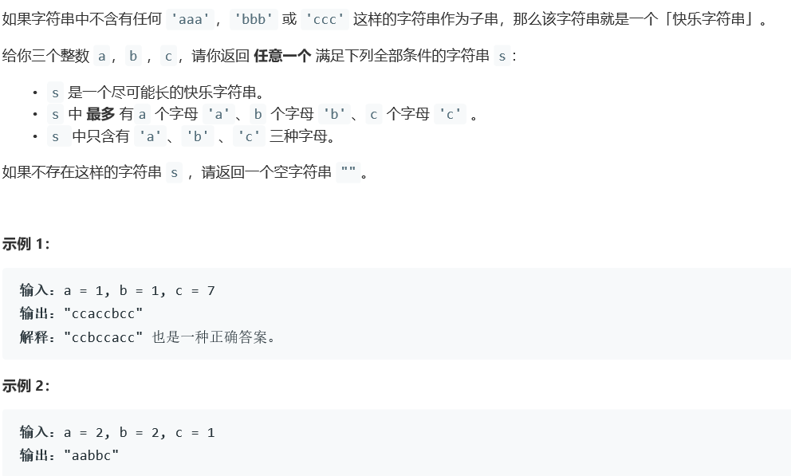

# 5195. 最长快乐字符串


  

    

## Java solution
```java
class Solution {
    public String longestDiverseString(int a, int b, int c) {
        MyChars[] myChars={
            new MyChars(a,'a'),
            new MyChars(b,'b'),
            new MyChars(c,'c')
        };
        StringBuilder s=new StringBuilder();
        //放置规则是每次都增加当前剩余长度最长的字符，同时不能有超过两个相同连续元素
        while(true)
        {
            Arrays.sort(myChars);
           if(s.length()>=2&&
           s.charAt(s.length()-1)==myChars[2].ch&&
           s.charAt(s.length()-2)==myChars[2].ch
           )
           {
               if(myChars[1].cnt>0)
               {
                 s.append(myChars[1].ch);  
                 --myChars[1].cnt;
               }
               else break;
           }
           else
           {
               if(myChars[2].cnt>0)
               {
                  s.append(myChars[2].ch);  
                 --myChars[2].cnt;
               }
               else break;
           }
        }
        return s.toString();
    }
    
}

class MyChars implements Comparable
{
    int cnt;
    char ch;
    public MyChars(int cnt, char ch) {
        this.cnt=cnt;
        this.ch=ch;
    }
    //升序排列
    @Override
    public int compareTo(Object o)
    {
         MyChars o1=(MyChars)o;
         return this.cnt-o1.cnt;
    }
    
}

```