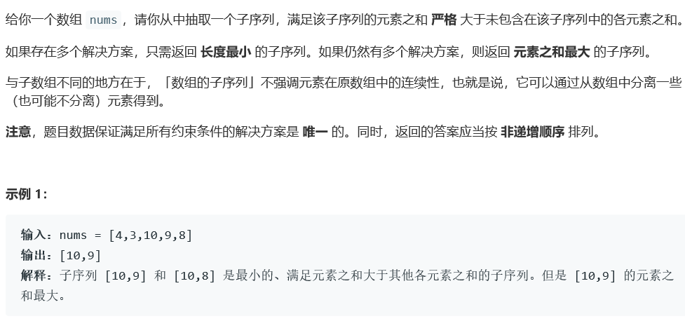
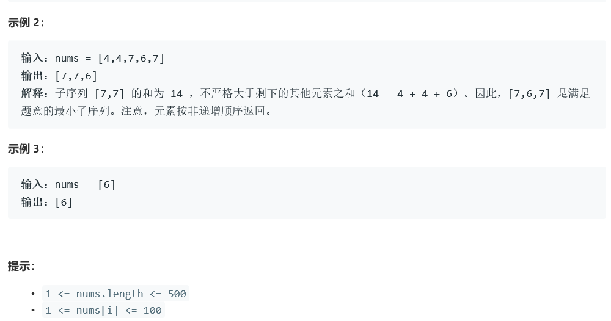

# 5376.非递增顺序的最小子序列


    

  


## Java solution
```java
class Solution {
    //子序列不是子串(子数组) 子串是连在一起的
    public List<Integer> minSubsequence(int[] nums) {
       List<Integer> res=new ArrayList<>();
       Arrays.sort(nums);
       int sum=0,cur=0;
       for(int i=0;i<nums.length;i++)
       {
          sum+=nums[i];
       }
       for(int i=nums.length-1;i>=0;i--)
       {
          if(cur>sum)break;
          else
          {
              sum-=nums[i];
              cur+=nums[i];
              res.add(nums[i]);
          }
       }
       return res;
    }
}
/*
class Solution {
    ArrayList<ArrayList<Integer>> res=new ArrayList<>();
    public List<Integer> minSubsequence(int[] nums) {
        int target=0;
        for(int i=0;i<nums.length;i++)
        {
            target+=nums[i];
        }
        helper(nums,0,target,0,new ArrayList<>());
        ArrayList<Integer> cur=res.get(0);
        for(int i=1;i<res.size();i++)
        {
            if(cur.size()>res.get(i).size())
            {
                cur=res.get(i);
            }
            else if(cur.size()<res.get(i).size()) continue;
            else
            {
                if(sum(cur)>=sum(res.get(i)))continue;
                else
                {
                    cur=res.get(i);
                }
            }
        }
         cur.sort(new Comparator<Integer>() {
            @Override
            public int compare(Integer o1, Integer o2) {
                int i = o1 < o2 ? 1 : -1;
                //System.out.println("开始比较 [o1] - " + o1 + "\t [o2] - " + o2);
                return i;
            }
        });
        return cur;
    }
    private void helper(int[] nums,int start,int target,int cur,ArrayList<Integer> path)
    {
        if(target<cur)
        {
            ArrayList<Integer> list=new ArrayList<Integer>(path);
            res.add(list);
            return;
        }
        for(int i=start;i<nums.length;i++)
        {
            path.add(nums[i]);
            helper(nums,i+1,target-nums[i],cur+nums[i],path);
            path.remove(path.size()-1);
        }
    }
    private int sum(ArrayList<Integer> l1)
    {
        int sum1=0;
        for(int i=0;i<l1.size();i++)
        {
            sum1+=l1.get(i);
        }
        return sum1;
    }
}
*/
```