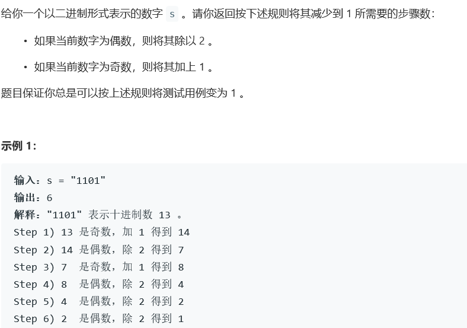
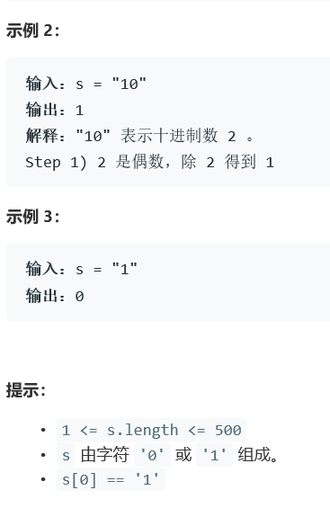

# 5377. 将二进制表示减到 1 的步骤数


  

    


## Java solution
```java
class Solution {
    /*
    //5ms 37.7MB
    public int numSteps(String s) {
        int cnt=0;
        ArrayList<Integer> list=new ArrayList<>();
        BitSet bitSet=new BitSet(s.length());
        for(int i=0;i<s.length();i++)
        {
            char c=s.charAt(i);
            list.add((int)(c-'0'));
        }
        while(!(list.size()==1&&list.get(0)==1))
        {
            if(list.get(list.size()-1)==0)
            {
                list.remove(list.size()-1);
            }
            else
            {
                int carry=1;
                int i;
                for(i=list.size()-1;i>=0;i--)
                {
                    int num=list.get(i)+carry;
                    if(num==0||num==1)
                    {
                        list.set(i,num);
                        carry=0;
                        break;
                    }
                    else
                    {
                        list.set(i,0);
                        carry=1;
                    }
                    
                }
                
                if(i==-1&&carry==1) 
                {
                    list.add(0,1);
                }
            }
            cnt++;
        }
        return cnt;
        
    }*/
    //1ms 37.2MB
    public int numSteps(String s) {
       char[] bits=s.toCharArray();
       int last=s.length()-1;
       int res=0;
       while(last>0)
       {
           ++res;
          if(bits[last]=='1')
          {  
            int i=last;  
            while(i>=0&&bits[i]=='1')
            {
              bits[i]='0';  
              --i;
            }
            if(i>=0)bits[i]='1';
          }
          else
          {
              --last;
          } 
       }
       return bits[last]=='0'?res+1:res;

    }
}


```