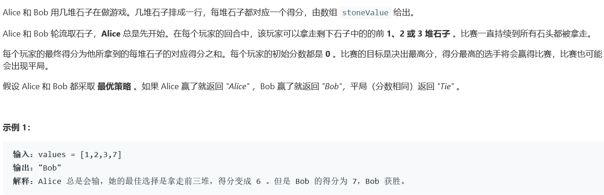
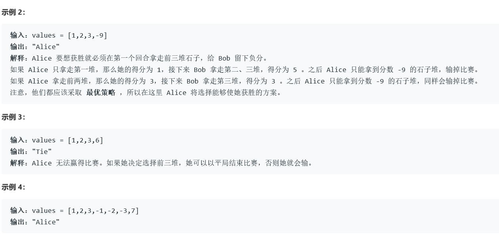
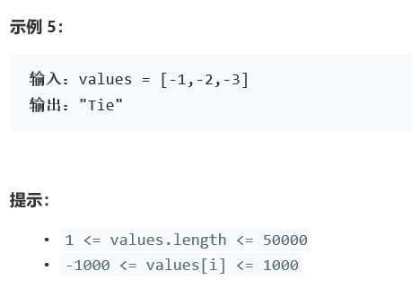

# 5379. 石子游戏 III

  

     

   


## Java solution
```java
class Solution {
    //4ms 49MB
    //dp[i] 表示当前玩家(Alice/Bob)从i开始到结束可能得到的最大分数
    //sum是i到结束的分数总和,当前你的选择有 “取走一、二、三堆”，结果就是给对方留下了 dp[i+1] dp[i+2] dp[i+3] 对应的情况。也就是对方能够得到的最高分就是 dp[i+1] dp[i+2] dp[i+3] 中的一个，而我们能得到的分数就是剩下的所有分数减去对方能拿到的分数。为了让我们拿到的更多，就得让对方拿到的最少。
    //因此有 dp[i]= sum{i,n} - min{dp[i+1],dp[i+2],dp[i+3]}，分别对应取走一堆、两堆、三堆石子的情况。
    public String stoneGameIII(int[] stoneValue) {
       int n=stoneValue.length;
       int[] dp=new int[n+3];
       int sum=0;
       for(int i=n-1;i>=0;i--)
       {
        sum+=stoneValue[i];
        dp[i]=sum-Math.min(dp[i+1],Math.min(dp[i+2],dp[i+3]));
       }
       int Alice=dp[0];
       int Bob=sum-dp[0];
       if(Alice==Bob) return "Tie";
       return Alice>Bob?"Alice":"Bob";
    }
}
```


