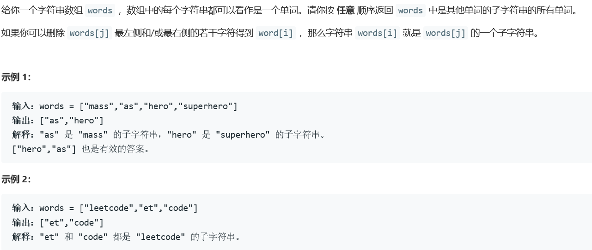
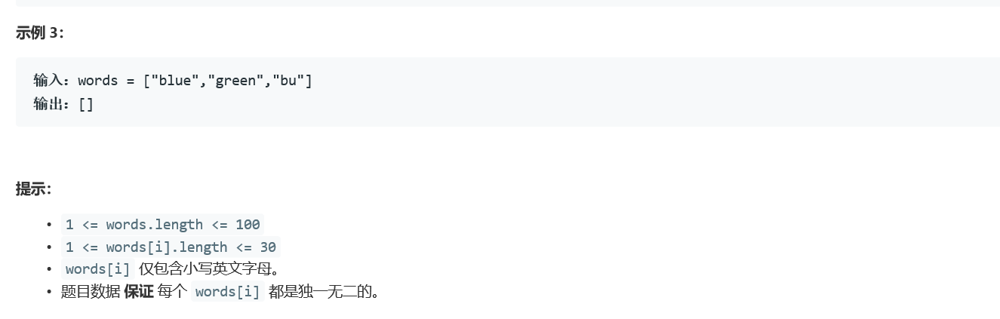

# 5380. 数组中的字符串匹配


  

    

## Java solution
```java
class Solution {
    public List<String> stringMatching(String[] words) {
        List<String> wordList=Arrays.asList(words);
        List<String> res=new ArrayList<>();
        Collections.sort(wordList, new SortByLengthComparator());
        for(int i=0;i<wordList.size()-1;i++)
        {
            //System.out.print(wordList.get(i)+"\n");
            for(int j=i+1;j<wordList.size();j++)
            {
                if(wordList.get(i).length()==wordList.get(j).length()) continue;
                if(wordList.get(j).indexOf(wordList.get(i))!=-1)
                {
                     res.add(wordList.get(i));
                     break;
                }
            }
        }
        return res;
    }
    private class SortByLengthComparator implements Comparator<String> 
    { 	
        @Override	
        public 
            int compare(String var1, String var2) 
        {		
            if (var1.length() > var2.length()) 
            {			
                return 1;		
            } 
            else if (var1.length() == var2.length()) 
            {			
                return 0;		
            } else 
            {			
                return -1;		
            }	
        } 
    }

}

```