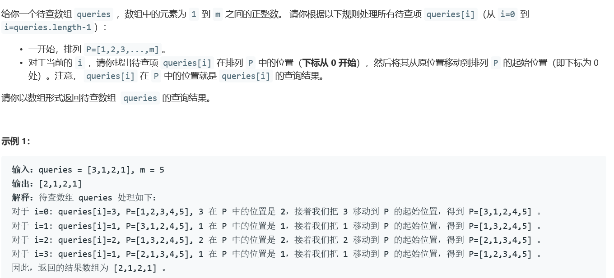
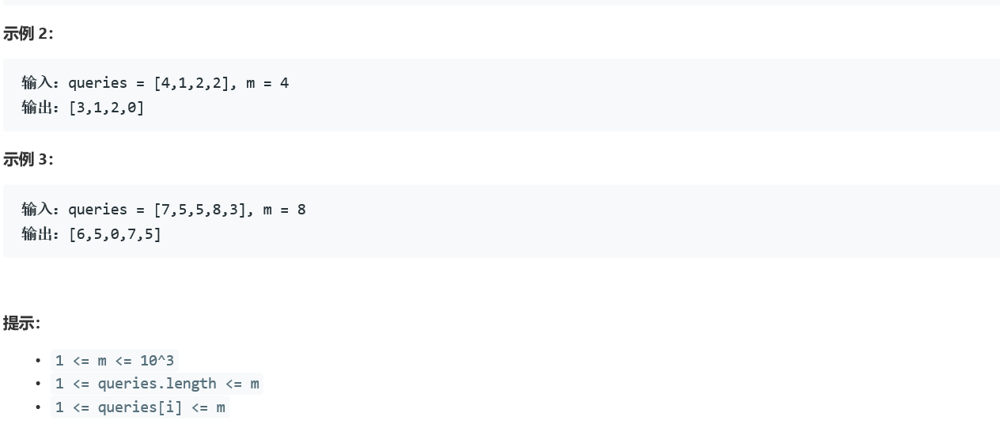

# 5381. 查询带键的排列

  

    


## Java solution
```java
class Solution {
    public int[] processQueries(int[] queries, int m) {
       int[] res=new int[queries.length];
       LinkedList<Integer> list=new LinkedList<>();
       for(int i=0;i<m;i++) list.add(i+1);
       for(int i=0;i<queries.length;i++)
       {
           for(int j=0;j<m;j++)
           {
               if(list.get(j)==queries[i])
               {
                   int temp=list.get(j);
                   list.remove(j);
                   list.addFirst(temp);
                   res[i]=j;
                   break;
               }
           }
       }
        return res;
    }
}

```