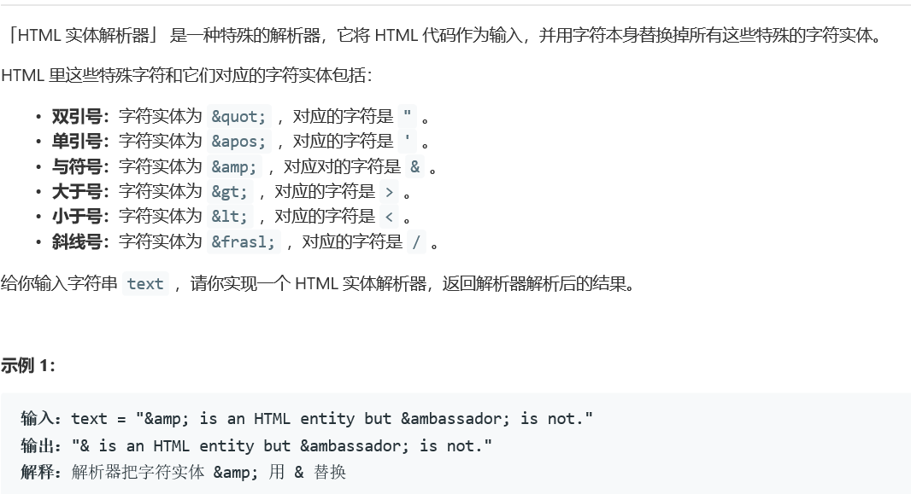
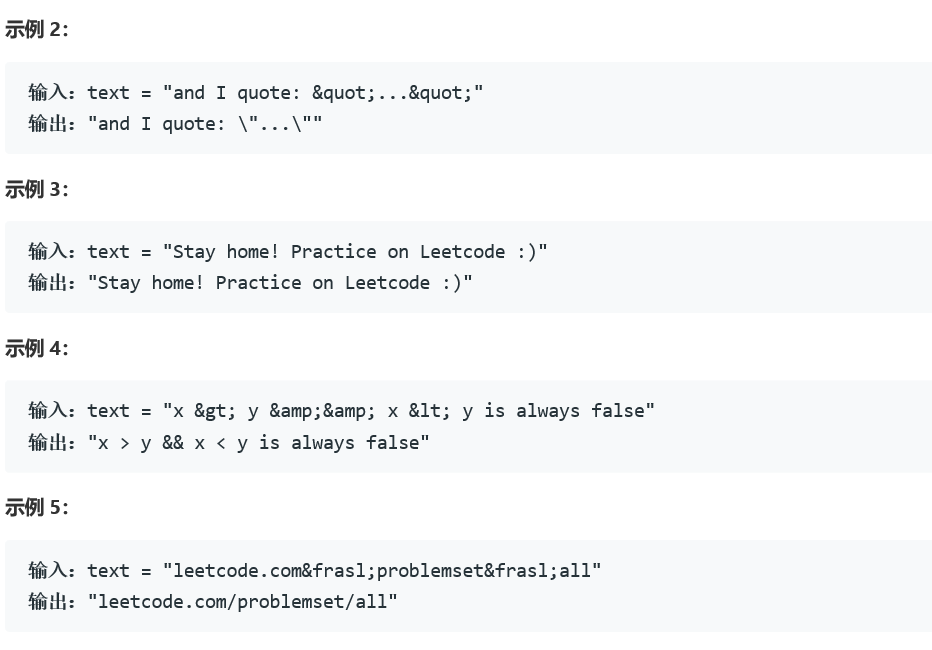

# 5382. HTML 实体解析器


    

  


## Java solution
```java
class Solution {
    public String entityParser(String text) {
         String res="";
        HashMap<String,String> map=new HashMap<>();
        map.put("&quot;","\"");
        map.put("&apos;","\'");
        map.put("&amp;","&");
        map.put("&gt;",">");
        map.put("&lt;","<");
        map.put("&frasl;","/");
        int i=0;
        char[] chars=text.toCharArray();
        while(i<text.length())
        {
            if(chars[i]=='&')
            {
                String cur="";
                while(i<text.length()&&chars[i]!=';')cur+=chars[i++];
                if(i<text.length()&&chars[i]==';')cur+=chars[i++];
                //System.out.print(cur+"\n");
                String replace=map.get(cur);
                if(replace!=null)res+=map.get(cur);
                else res+=cur;
                
            }
            else
            {
                res+=chars[i++];
            }
        }
        return res;
    }
}
```