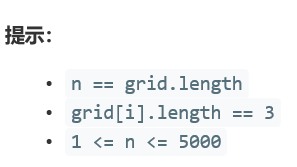

# 5383. 给 N x 3 网格图涂色的方案数

  

     

   




## Java solution
```java
class Solution {
    //5ms 36.6MB
    /*
    在第一层可以摆出6个ABA类型的和6个ABC类型的涂法。对于下面每一层，每一个ABA涂法可以拼接2个ABC涂法和3个ABA涂法，每一个ABC涂法可以拼接2个ABC涂法和2个ABA涂法。这样迭代可以算出第N层有几种ABA涂法和ABC涂法，相加就是答案。
    */
    long res=0;
    public int numOfWays(int n) {
      long modNum=(long)Math.pow(10,9)+7;
      long aba=6,abc=6;
      for(int i=1;i<n;i++)
      {
         long temp=aba;
         aba=((3*aba)%modNum+(2*abc)%modNum)%modNum;//防止迭代过程中越界
         abc=((2*temp)%modNum+(2*abc)%modNum)%modNum;
      }
      //backTrack(n-1,0,0,prev,cur);
      return (int)((aba+abc)%modNum);
    }
    //回溯算法--超时
    private void backTrack(int n,int i,int j,int[] prev,int[] cur)
    {
        if(n==i&&j==3)
        {
            ++res;
            return ;
        }
        if(j==3)
        {
            int[] temp=new int[3];
            backTrack(n,i+1,0,cur,temp);
            return;
        }
        for(int k=1;k<=3;k++)
        {
            if(j==0)
            {
                if(k!=prev[j])
               {
                 cur[j]=k;   
                 backTrack(n,i,j+1,prev,cur);  
               }
            }
            else
            {
                if(k!=cur[j-1]&&k!=prev[j])
               {
                 cur[j]=k;   
                 backTrack(n,i,j+1,prev,cur);    
               }
            }
        }
    }
}
```


