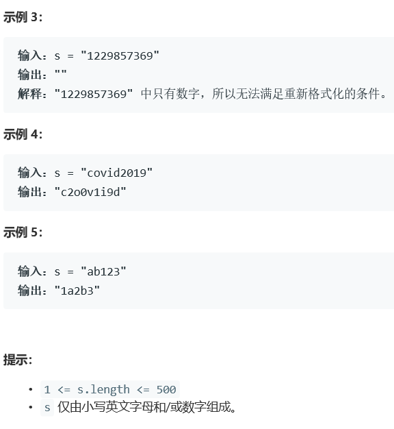

# 5388. 重新格式化字符串

  

     


## Java solution
```java
class Solution {
    public String reformat(String s) {
         List<Character> list1=new ArrayList<>();
         List<Character> list2=new ArrayList<>();
        String res="";
        for(char c:s.toCharArray())
        {
            if(c>='0'&&c<='9')
            {
                list1.add(c);
            }
            else
            {
                list2.add(c);
            }
        }
        if(list1.size()>=list2.size())
        {
            if(list1.size()-list2.size()>1) return "";
            int j=0,k=0;
            for(int i=0;i<list1.size()+list2.size();i++)
            {
                if(i%2==0)
                {
                    res+=list1.get(j++);
                }
                else
                {
                    res+=list2.get(k++);
                }
            }
        }
        else
        {
             if(list2.size()-list1.size()>1) return "";
            int j=0,k=0;
            for(int i=0;i<list1.size()+list2.size();i++)
            {
                if(i%2==1)
                {
                    res+=list1.get(j++);
                }
                else
                {
                    res+=list2.get(k++);
                }
            }
        }
        return res;
    }
}
```


