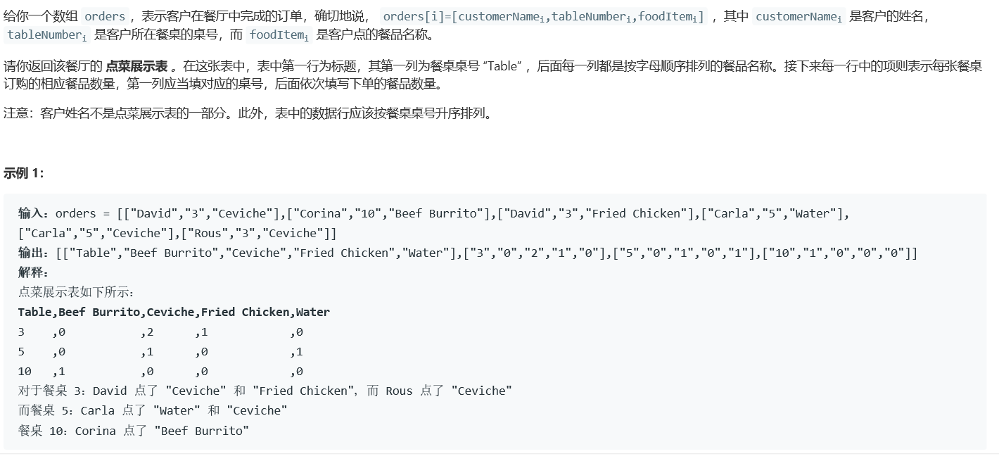

# 5389. 点菜展示表


    

  


## Java solution
```java
class Solution {
    public List<List<String>> displayTable(List<List<String>> orders) {
        HashMap<String,HashMap<String,Integer>> menu=new HashMap<>();
        List<List<String>> res=new ArrayList<>();
        Set<String> foods=new HashSet<>();
        for(int i=0;i<orders.size();i++)
        {
            List<String> cur=orders.get(i);
            String tableNum=cur.get(1);
            if(!foods.contains(cur.get(2))) foods.add(cur.get(2));
            if(!menu.containsKey(tableNum))
            {
                HashMap<String,Integer> map=new HashMap<>();
                map.put(cur.get(2),1);
                menu.put(tableNum,map);
            }
            else
            {
                HashMap<String,Integer> map=menu.get(tableNum);
                if(map.containsKey(cur.get(2)))
                {
                    map.put(cur.get(2),map.get(cur.get(2))+1);
                }
                else
                {
                    map.put(cur.get(2),1);
                }
                menu.put(tableNum,map);
            }
        }
        List<String> firstRow=new ArrayList<>();
        for(String str:foods)
        {
            firstRow.add(str);
        }
         
        Collections.sort(firstRow, new Comparator<String>() {
           @Override
      public int compare(String o1, String o2) {
         int i = o1.compareTo(o2);
        if(i>0) {
          return 1;
        }
        else if(i<0){
          return -1;
        }
          else return 0;
      }
        });
        firstRow.add(0,"Table");
        for (String key : menu.keySet()) {
	        List<String> cur=new ArrayList<>();
            cur.add(key);
            HashMap map=menu.get(key);
            for(int i=1;i<firstRow.size();i++)
            {
                if(map.containsKey(firstRow.get(i)))
                {
                    System.out.println(map.get(firstRow.get(i)));
                    //Integer cnt=map.get(firstRow.get(i));
                    String temp=""+map.get(firstRow.get(i));
                    cur.add(temp);
                }
                else
                {
                    cur.add("0");
                }
            }
            res.add(cur);
         }
         Collections.sort(res, new Comparator<List<String>>() {
           @Override
      public int compare(List<String> o1, List<String> o2) {
         int num1=Integer.parseInt( o1.get(0) ); 
         int num2=Integer.parseInt( o2.get(0) ); 
        if(num1 > num2) {
          return 1;
        }
        else if (num1 < num2){
          return -1;
        }
        else {
          return 0;
        }
      }
        });
        res.add(0,firstRow);
         return res;
    }
}
```