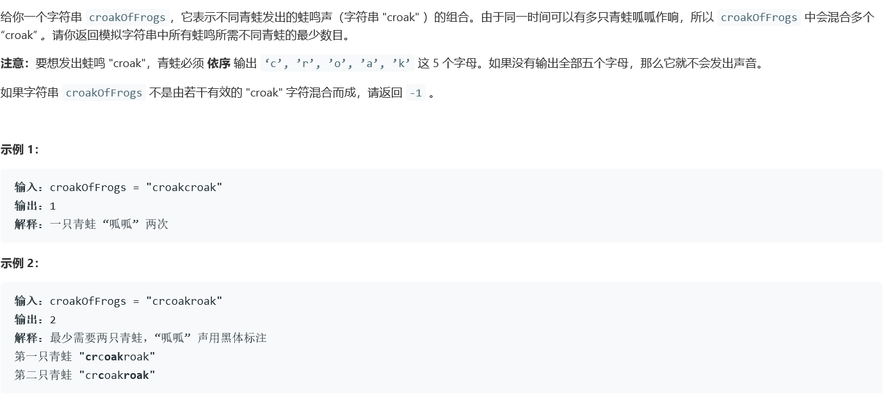
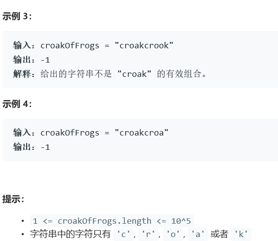

# 5390. 数青蛙


  

    

## Java solution
```java
class Solution {
    //8ms 40.2MB
    //c,r,o,a,k统计之前仍需要配对的对应字符的数目  若小于0则配对失败 返回-1
    public int minNumberOfFrogs(String croakOfFrogs) {
        if(croakOfFrogs.length()<5||croakOfFrogs.length()%5!=0) return -1;
        int c=0,r=0,o=0,a=0,k=0;
        int res=0;
        for(char ch:croakOfFrogs.toCharArray())
        {
            switch(ch)
            {
                case 'c':
                {
                    if(k>0)
                    {
                       --k;
                    }
                    else
                    {
                        ++res;
                    }
                    ++c;
                    break;
                }
                case 'r':
                {
                    ++r;--c;
                    break;
                }
                case 'o':
                {
                    ++o;--r;
                    break;
                }
                case 'a':
                {
                    ++a;--o;
                    break;
                }
                case 'k':
                {
                    ++k;--a;
                    break;
                }
                default:break;
            }
            if(c<0||r<0||o<0||a<0||k<0)
              {
                  return -1;
              }
        } 
         if(c<0||r<0||o<0||a<0||k<0)
          {
            return -1;
          }
        return res;
    }
}

```