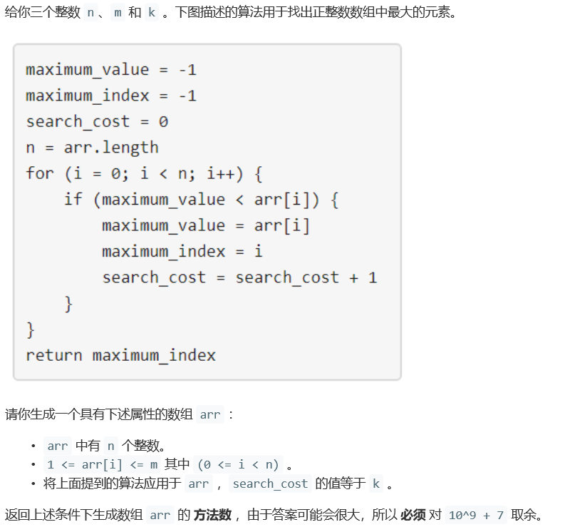
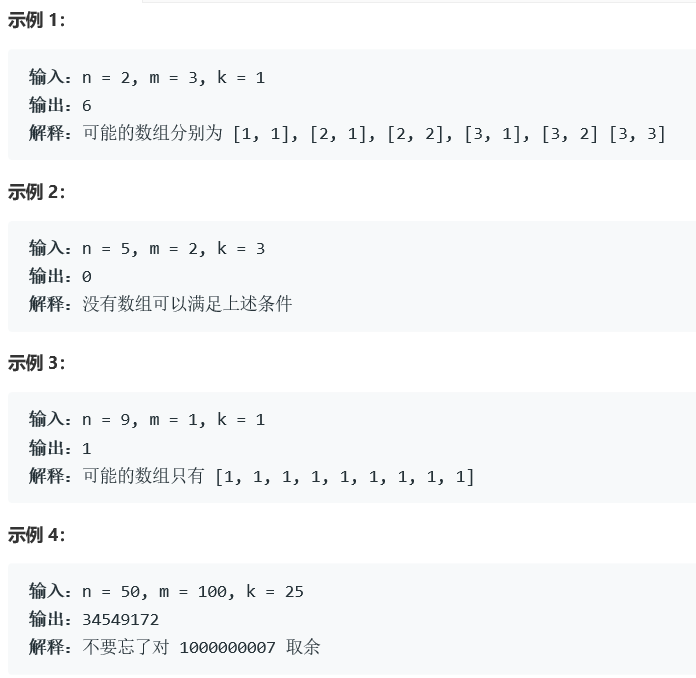
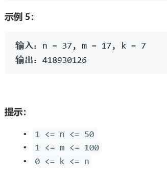

# 5391. 生成数组

  



    


## Java solution
```java
class Solution {
    public int numOfArrays(int n, int m, int k) {
        long MOD=1000000007L;
        long[][][] dp=new long[n+1][k+1][m+1];//i长度 serach_cost=p 最大值为v的方案数
        dp[0][0][0]=1;
        for(int i=1;i<=n;i++)
        {
            for(int p=0;p<=k;p++)
            {
                for(int l=0;l<=m;l++)
                {
                    for(int v=1;v<=m;v++)
                    {
                        //np--next_p nv--next_v  长度i-1对应serach_cost=p 最大值为l
                        //当前长度i 对应serach_cost=np 最大值为nv
                        int np=p,nv=Math.max(l,v);if(v>l)np++;
                        if(np>k) continue;
                        dp[i][np][nv]=(dp[i][np][nv]+dp[i-1][p][l])%MOD;
                    }
                }
            }
        }
        long ans=0;
        for(int i=1;i<=m;i++)
        {
            ans=(ans+dp[n][k][i])%MOD;
        }
        return (int)ans;
    }
}
```