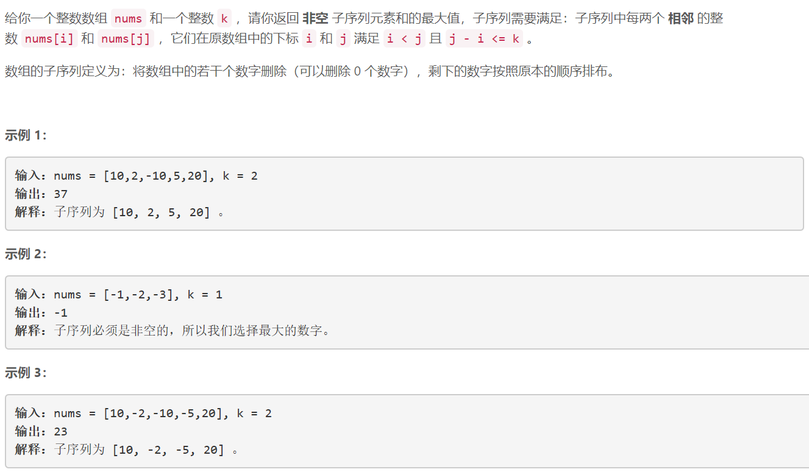
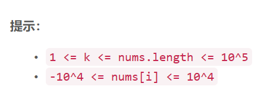

### 5180. 带限制的子序列和


    

  


## Java solution
```java
class Solution {
    public int constrainedSubsetSum(int[] nums, int k) {
        int n=nums.length;
        int[] dp=new int[n];//保存从开始到i位置的最小子序列和
        TreeSet<Integer> set=new TreeSet<Integer>();
        int res=nums[0];
        set.add(nums[0]);
        dp[0]=nums[0];
        for(int i=1;i<n;i++)
        {
           if(i-k>0)set.remove(dp[i-k-1]);//当i>k 之后 set中始终维护着dp[i-k] ...dp[i-1] k个数 这些数是dp[i]可以达到的范围内的数
           dp[i]=Math.max(nums[i],set.last()+nums[i]);
           set.add(dp[i]);
           res=Math.max(res,dp[i]);
        }
        return res;
    }
}
```