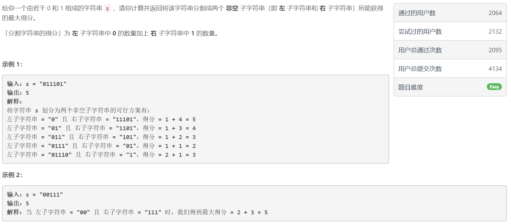
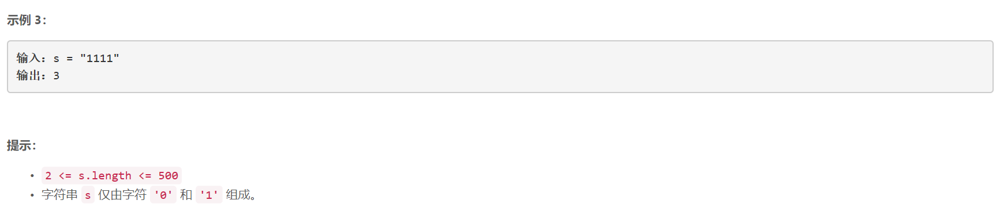

### 5392. 分割字符串的最大得分

  

     


## Java solution
```java
class Solution {
    public int maxScore(String s) {
         int n=s.length(); 
         int[] dp=new int[n];
         int cur=0; 
         dp[0]=s.charAt(0)=='0'?1:0;
         for(int i=1;i<n;i++)
         {
             char c=s.charAt(i);
             dp[i]=c=='0'?dp[i-1]+1:dp[i-1];
         }
        int res=0;
        cur=0;
        for(int i=n-1;i>0;i--)
        {
            char c=s.charAt(i);
            cur=c=='1'?cur+1:cur;
            res=Math.max(dp[i-1]+cur,res);
        }
        return res;
    }
}
```


