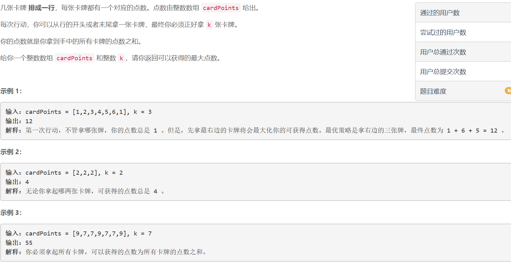
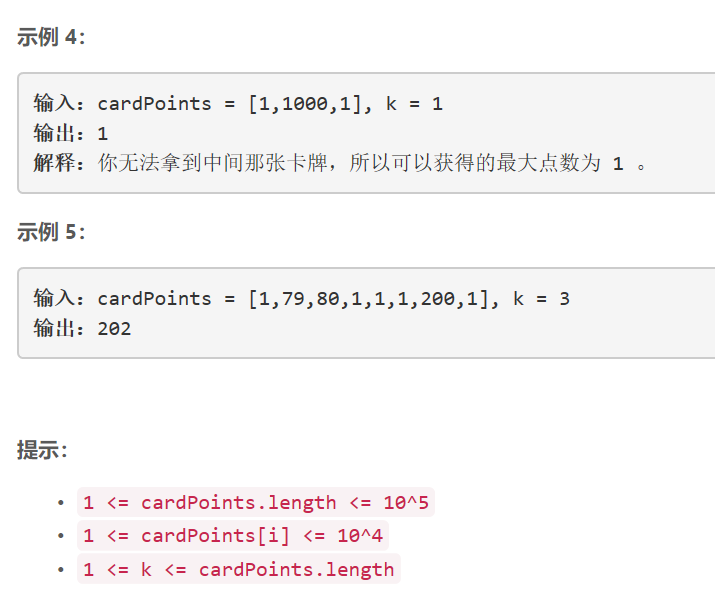

### 5393. 可获得的最大点数


  

    

## Java solution
```java
class Solution {
    public int maxScore(int[] cardPoints, int k) {
        int n=cardPoints.length;
        int res=0;
        int[] dp=new int[k+1];
        int[] dp1=new int[k+1];
        dp[0]=0;
        dp1[0]=0;
        for(int i=0;i<k;i++)
        {
            dp[i+1]=cardPoints[i]+dp[i];
            dp1[i+1]=cardPoints[n-i-1]+dp1[i];
        }
        for(int i=0;i<=k;i++)
        {
            System.out.print(i+" "+(k-1-i)+"\n");
            System.out.print(dp[i]+" "+dp1[k-i]+"\n");
            res=Math.max(res,dp[i]+dp1[k-i]);
        }
        return res;
    }
}

```