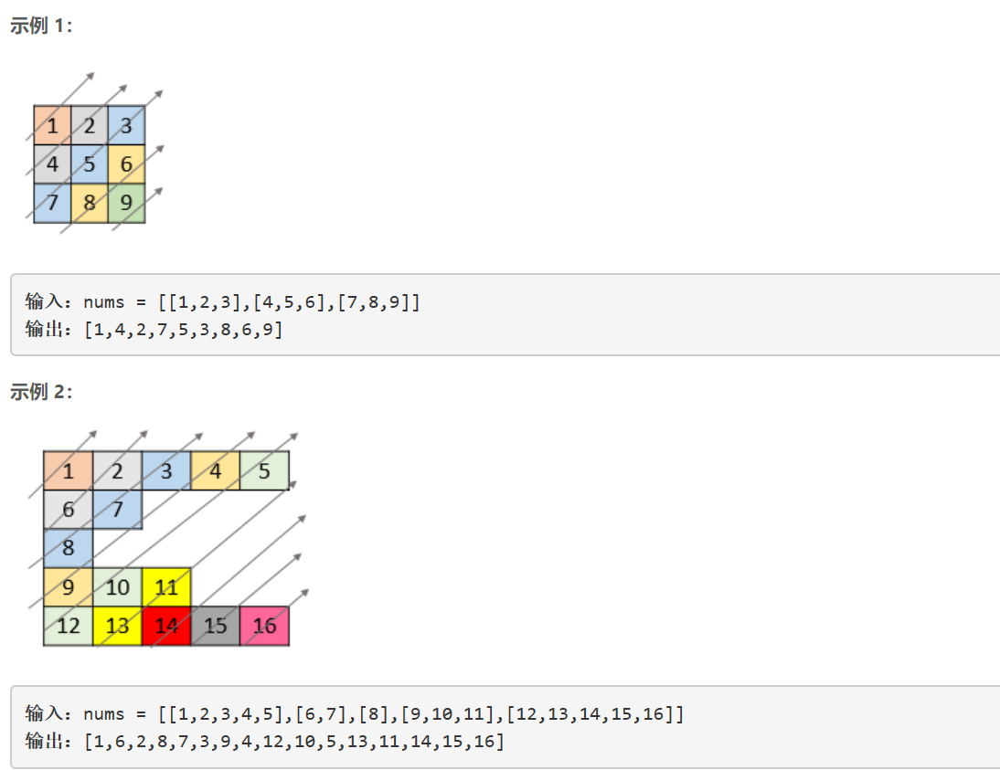
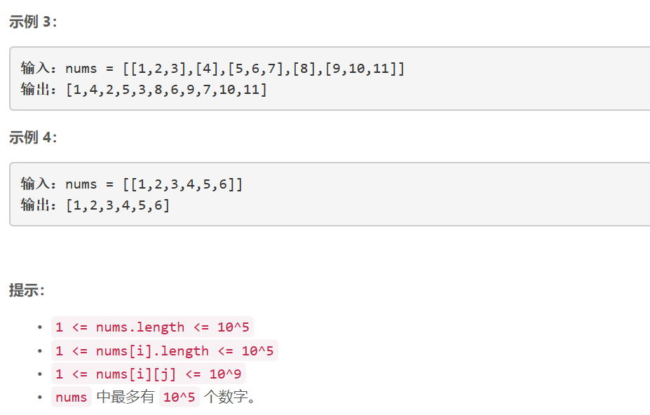

### 5394. 对角线遍历 II

  




## Java solution
```java
class Solution {
    //对角线上索引之和为常数
    public int[] findDiagonalOrder(List<List<Integer>> nums) {
        List<List<Integer>> l=new ArrayList<>();
        int cnt=0;
        for(int i=nums.size()-1;i>=0;i--)
        {
            List<Integer> cur=nums.get(i);
            for(int j=0;j<cur.size();j++)
            {
                if(i+j<l.size())
                {
                    List<Integer> temp=l.get(i+j);
                    temp.add(cur.get(j));
                    l.set(i+j,temp);
                }
                else
                {
                    while(l.size()!=(i+j+1))l.add(new ArrayList<>());
                    List<Integer> temp=l.get(i+j);
                    temp.add(cur.get(j));
                    l.set(i+j,temp);
                }
            }
            cnt+=cur.size();
        }
        int[] ans=new int[cnt];
        cnt=0;
        for(List<Integer> L:l)
        {
            for(Integer num:L)
            {
                ans[cnt++]=num;            
            }
        }
        
        return ans;
    }
}
```