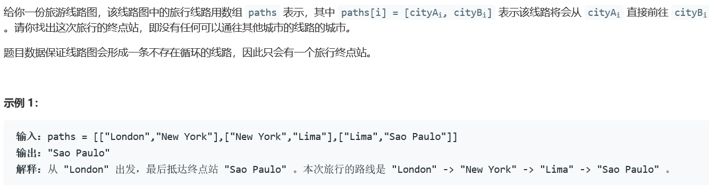
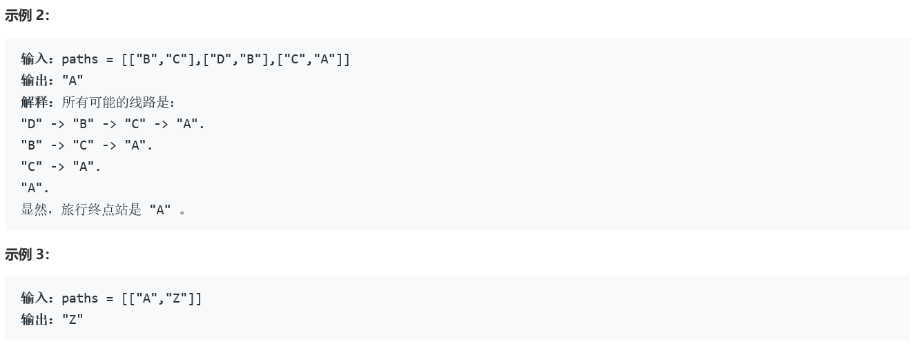
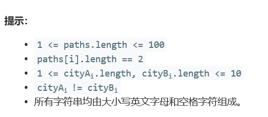

### 5400. 旅行终点站


    



  


## Java solution
```java
class Solution {
    public String destCity(List<List<String>> paths) {
      HashMap<String,Integer> src=new HashMap<>();
      for(int i=0;i<paths.size();i++)
      {
          List<String> path=paths.get(i);
          src.put(path.get(0),i);
      }
      String res="";
      String start=paths.get(0).get(0);  
      int nxt=0; 
      while(nxt!=-1)
      {
          res=paths.get(nxt).get(1); 
          nxt=src.getOrDefault(res,-1);
      }
      return res;
    }
}
```