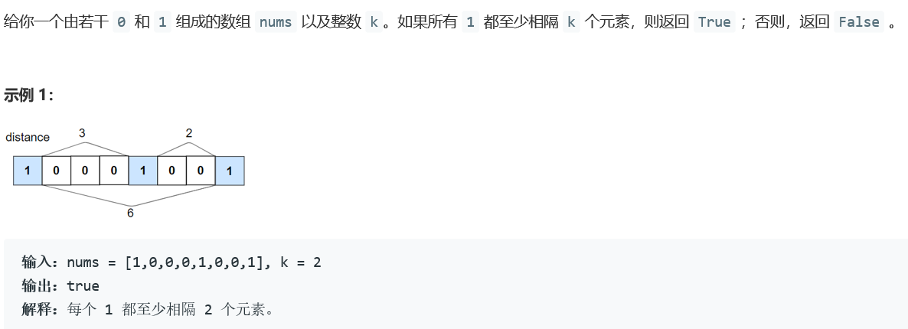
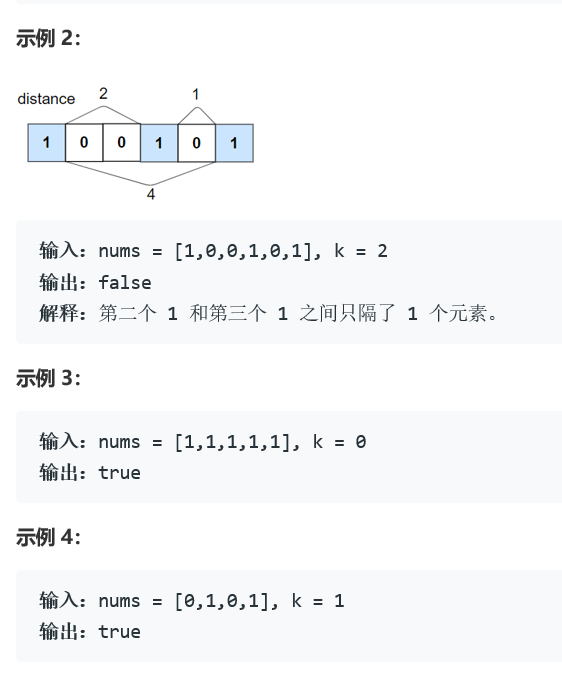
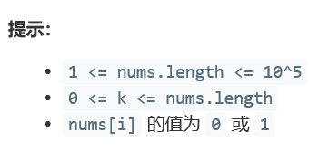

### 5392. 分割字符串的最大得分

  



     


## Java solution
```java
class Solution {
    public boolean kLengthApart(int[] nums, int k) {
         int i=0,n=nums.length;
         while(i<n)
         {
             while(i<n&&nums[i]==0)++i;
             int j=i+1;
             for(;j<n&&j<=i+k;j++)
             {
                 if(nums[j]==1)return false;
             }
             i=j;
         }
        return true;
    }
}
```


