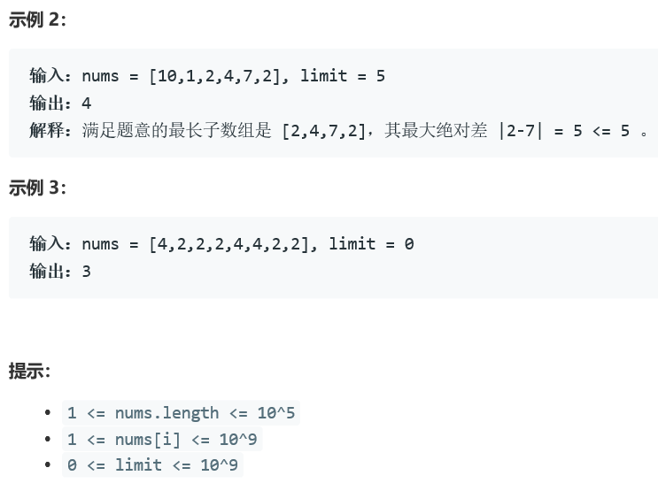

### 5402. 绝对差不超过限制的最长连续子数组


  

    

## Java solution
```java
class Solution {
    /*public int longestSubarray(int[] nums, int limit) {
        int n=nums.length;
        int res=0;
        int l=0,r=0;
        int max=0;
        int min=Integer.MAX_VALUE;
        while(r<n)
        {
            while(r<n)
            {
              max=Math.max(max,nums[r]);  
              min=Math.min(min,nums[r]); 
              if(max-min>limit) break; 
              r++;
            }
            res=Math.max(r-l,res);
            if(r==n)break;
            //倒序查找每个位置在当前子区间中从后向前遍历的最大值和最小值
            int[] Max=new int[r-l];
            int[] Min=new int[r-l];
            Arrays.fill(Max,0);
            Arrays.fill(Min,Integer.MAX_VALUE);
            Max[r-l-1]=nums[r];
            Min[r-l-1]=nums[r];
            for(int i=r-l-2;i>=0;i--)
            {
                Max[i]=Math.max(Max[i+1],nums[i+l+1]);
                Min[i]=Math.min(Min[i+1],nums[i+l+1]);
            }
            int i=0;
            while(l<r&&max-min>limit)
            {
                max=Max[i];
                min=Min[i];
                i++;
                l++;
            }
        }
        return res;
    }*/
    //Priority_Queue.remove(Object O)
    //参数：参数O属于PriorityQueue类型，并指定要从PriorityQueue中删除的元素。
    //返回值：如果指定的元素存在于队列中，则此方法返回True，否则返回False。
    public int longestSubarray(int[] nums, int limit) {
        PriorityQueue<int[]> nature = new PriorityQueue<>((o1, o2) -> o1[1] - o2[1]);
        PriorityQueue<int[]> reverse = new PriorityQueue<>((o1, o2) -> o2[1] - o1[1]);
        int max = 0;
        int left = -1;
        for(int i = 0; i < nums.length; i++) {
            while(reverse.size() > 0 && (reverse.peek()[1] - nums[i] > limit || reverse.peek()[0] < left)) {
                left = Math.max(left, reverse.poll()[0]);
            }
            while (nature.size() > 0 && (nums[i] - nature.peek()[1] > limit || nature.peek()[0] < left)) {
                left = Math.max(left, nature.poll()[0]);
            }
            nature.add(new int[]{i, nums[i]});
            reverse.add(new int[]{i, nums[i]});
            max = Math.max(max, i - left);
        }
        return max;
    }
}

```